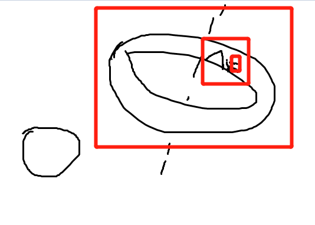

- 发明一套基于汉字的表音文字，可以完全从英语转成这套文字。  
  collapsed:: true
	- [汉语注音符号_百度百科](https://baike.baidu.com/item/%E6%B1%89%E8%AF%AD%E6%B3%A8%E9%9F%B3%E7%AC%A6%E5%8F%B7/115195)
	- 它是注音吗？
	- 它是日语假名吗？
	- 阿拉伯数字也要转吗？
	- 为什么要这套文字？
	- 不切换输入法实现中英文混合输入
	- 可以轻松的转变成英文
- 空间站在哪里？#聊天记录  
  collapsed:: true
	- 卮言:
	- [阅兵的图片]
	- 终于可以回家了
	- stargazer:  
	  刚从学校回来
	- stargazer:  
	  去爬爬楼
	- 卮言:  
	  去接飞机了
	- Steven陈:  
	  从我楼上飞过
	- stargazer:  
	  阅兵吗
	- 卮言:  
	  表演
	- stargazer:  
	  好帅
	- Deciia:  
	  爬楼爬到飞机上，飞机停在楼顶，楼顶在云上，云在山脚，山在空间站……
	- Deciia:  
	  那么，空间站在哪里
	- Calvin Chang:  
	  废土版：空间站在废墟里
	- 主叙事版：空间站在火星上
	- Fantasy版：空间站在环法自行车道上
	- Deciia:
	- 
	- 空间站在地球上空
	- Calvin Chang:  
	  那你这个是常识版
	- Deciia:
	- 一句正常，下一句反常识，地球在哪里就需要反常识了，比如地球在月球里面，绕月心运动