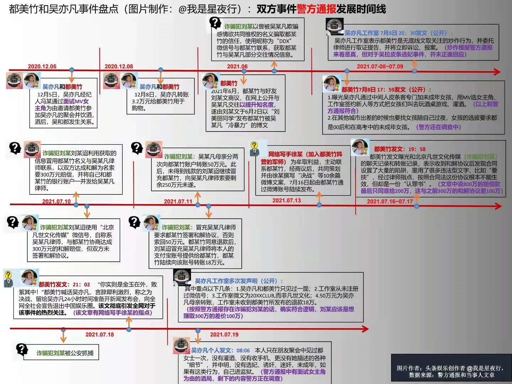

- 苏州晴转多云27-34度
- 社交与社区的区别  
  collapsed:: true
	- 当“社交”这一概念被商业化，被产品化之后，本质上应该还是定位在解决“人与人之间的关系”，基于人的关系实现信息传递、思想交流。
	- 基于人际关系产生内容，是社交；基于内容而有的人际关系，是社区。
	- [社交梦？先想清楚社交是什么 | 人人都是产品经理](https://www.woshipm.com/it/2856315.html)
- [科技爱好者周刊（第 168 期）：游戏《底特律：变人》](https://mp.weixin.qq.com/s/PsrtZyyI12fheTfBzaZsbQ)
  collapsed:: true
	- 做完你的项目  
	  collapsed:: true
		- 如果要为 UNIX 哲学添加一个原则，我认为应该是：  
		  “做完你的项目。”  
		  这是我能想到的最简单、但最被忽视的软件工程准则。  
		  大多数软件其实都没有真正完成，作者只是做出了基本功能，然后就发布了。很多软件后来不做了，也不是因为做完了，而是作者放弃了。  
		  让我们把程序员比作木匠。你买了一把椅子，因为觉得它能满足你的需求。可是买来以后，每隔几天，木匠就会出现在你的家里，对椅子进行修改。有些变动是你想要的，有些你无所谓，还有一些变动只会让你心生反感。甚至有时候，木匠还会出错，比如木头上伸出了一些尖刺，使椅子不再可用。  
		  你买的是椅子，而不是某种千变万化的家具，没人喜欢每天会变的椅子。  
		  程序员也是如此，应该对软件有一个总体规划，让它有一个完整的基本功能。虽然以后可以进行维护、错误修复和安全补丁，但基本功能应该从始至终都是完整清晰的。  
		  你不能说，因为出现了新情况，所以需要不断改变或完善它的功能。如果一个软件一直在加功能，它就太大了，超出了你应该做的东西。你试图制造一个超出合理范围的东西，你需要画一下功能图，将过大的软件拆分成几个功能完整且合理的小软件。  
		  总之，做完你的项目再发布。用户拿到的，应该是一个基本上做完的项目。
	- 为什么要学习心肺复苏
	  collapsed:: true
		- 比起琴棋书画的培训班，国家应该培训家长必须学会心肺复苏，学校里也要教育孩子学会心肺复苏。让身边的每一个人都成为有能力能救助别人的人，作为升职加薪子女入学的必需品。
		- 今日头条读者，评论一个医生在郑州地铁5号线做6小时心肺复苏，救了十几个人。
	- 开发环境和用户环境  
	  collapsed:: true
		- PC 游戏里面的文字大小，这几年变得如此之小，以至于没法在电视机上玩，因为在正常观看距离下，几乎无法在电视屏幕上阅读这些文字。游戏的开发人员大概都是在离大型显示器几英寸的地方开发游戏，而没有考虑到很多人会在电视机上玩游戏。
- [灾后郑州：当一座都市忽然失去了互联网 | 故事硬核](https://mp.weixin.qq.com/s/ZE2cOdHTi-Kn0N04FMOcMw)
- 都美竹和吴亦凡事件 #故事灵感  
  collapsed:: true
	- 
- 德国专家：没有任何城市排水系统能应对郑州暴雨  
  collapsed:: true
	- “德国之声”网站7月22日发表文章称，中国河南郑州等地区近日遭遇连续强降雨，造成大规模洪涝灾害的消息也引起了德国学者的注意。德国锡根大学洪涝专家严森（Jürgen Jensen）教授坦言，郑州最大小时降雨量达到201.9毫米，世界上没有任何一个城市的排水系统能应对这样的情况。
	- [德国专家：没有任何城市排水系统能应对郑州暴雨](https://mp.weixin.qq.com/s/f3rRL8IyxvdBcl9TUfnx3w)
- 为什么所有的台风都会绕开上海?  
  collapsed:: true
	- 夏季决定台风走向最重要的系统之一便为副热带高压。在通常时候，它都稳稳地趴在西北太平洋洋面上，强的时候会和陆高强强联手给江南华南一带带来持续高温天气<!-- -->而台风往往在副高南侧或者西侧的牵引气流下运动，副高通常趴在的位置就决定了大多数台风运行的位置。副热带高压强的时候台风登陆华南，华东浙江福建一带概率大，副热带高压弱的时候往往崩溃性东彻，台风就被西侧的气流引向了日本一带。而魔都往往处于两者中间尴尬的位置，自然很难受到台风的直接攻击
	- [为什么所有的台风都会绕开上海? - 知乎](https://www.zhihu.com/question/36202824/answer/138380875)
- [AlphaFold 震撼发布 98.5% 的人类蛋白结构预测结果，有哪些重大突破？它们将带来哪些应用？ - 知乎](https://www.zhihu.com/question/474094187)
- 控制梦境 #故事灵感  
  collapsed:: true
	- 同事尝试控制梦境。在前往矿山前，已经想象到矿山的画面，为什么不能直接跳到矿山场景，而是想象自己能飞起来，然后飞到矿山某处高楼上，然后控制想象自己安全落地，然后才到矿山
	- 梦境是可以控制的，但是切换场景有一定难度，这是否意味着梦境在整理记忆碎片时从其它区域调用的成本比较高，梦境看到的画面同样会让人恐惧，从而惊醒过来，但是可以通过控制画面来消除恐惧。
- 互联网社区的围墙  
  collapsed:: true
	- 人通过设备客户端连接到到一起，形成一定程度上独立的社区
	- 互联网消除了端到端的信息交流的空间限制，但是不会消除互联网社区的围墙，即使社区成为系统的插件，也不能强行将两个社区的人融合在一起
- 扇子振动的两种方式  
  collapsed:: true
	- 一种是以手腕为支点，让整个扇面在一定角度内摆动
	- 一种是控制手腕小幅度振动，向扇面传递一个波浪，这样是不是更偏向自然风？
- 乔治 奥威尔的几条写作规则 #写作教程  
  collapsed:: true
	- 1.永远不要频繁使用明喻、暗喻以及其他各种比喻。  
	  2.在能短的地方,绝不要长。  
	  3.凡是能删掉的词一律删掉。  
	  4.能用主动句的地方,绝不用被动句。  
	  5.凡是能用日常词汇表达的时候,绝不用外语、术语或职业行话。  
	  6.一旦发现自己的话纯属胡说八道,可不遵守上述任何一条规则。