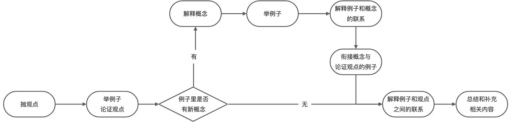

- 星期二，苏州阴转大雨25-27度
- 微软的azure文字转语音编辑器  
  collapsed:: true
	- [Speech Studio - Microsoft Azure](https://speech.microsoft.com/portal)
- 微信暂停个人帐号新用户注册  
  collapsed:: true
	- [如何看待微信暂停个人账号新用户注册，透露了哪些信息？ - 知乎](https://www.zhihu.com/question/475208084)
- 如何写清楚一个观点？
  collapsed:: true
	- 异恒注：诶，原地址弄丢了
	- 事情起因是这样，我同学最近开始看各种人文社科类的书，有了不少心得，然后写了篇想法让我 review 一下。然后看下来我感觉实在有点晦涩。正好当时也看了相关的内容有些感触，就帮忙改了一段做了示例，还并顺便梳理了下写清楚一个观点的流程。（结合 [@林外(lyndon)](https://www.yuque.com/lyndon) 写的 [林外：我讲不清楚事情，怎么办？ · 语雀](https://www.yuque.com/lyndon/daylesson/tyxoqs)一起食用效果更加~）
	- 观点论述的流程图如下
	  collapsed:: true
		- 
	- [林外：我讲不清楚事情，怎么办？ · 语雀](https://www.yuque.com/lyndon/daylesson/tyxoqs)
	  collapsed:: true
		- 说人话，要用比喻的方式，把复杂的概念讲清楚。比如：BaaS，就是蚂蚁链的小程序；免费提现，打开支付余额的第二屏一点就行；权益宝，就是用户可以用联通积分，来买蚂蚁森林的能量罩；商业中台，就是蚂蚁链的地网（主管之前带过地网）。
			- 上述的比喻不完全精确，但是非常贴切。所以沟通上的一个认知误区：❌  我需要传递非常精确的术语，这样对方就能理解了❌  。业务是实现模型，听众是用户模型，我要用我的设计模型，来拟合实现模型和用户模型。精确，是对的，但是没有用、也无趣；我们要的是能理解和有体感，思维上的共振。
			- 隐喻或者比喻，是常规且高阶的沟通方式。第一，我懂了 A 东西是是啥，第二、我懂了 B 东西是啥，第三、我懂了如何将 A 东西和 B 东西关联起来，并进行说明。
		- 定调子，我讲的第一句话，一定很重要，如果能用通俗的概念开场，才会有兴趣听下去。用专业术语解释专业，是不专业的表现；因为，这只是表达我知道这件事，并没有考虑别人听不听得懂。俗称，自嗨。
		- 看反馈，不要只顾着讲，或者担心有留白会尴尬，所以一直拼命讲。慢一点，给些空间让人思考。留白，是沟通上的艺术，让听者有空思考，让我有机会观察他的反应：他听懂了么？他是不是不想听了？我是不是讲的太满了？
			- 好几位同学，对着文档一个一个念下来。但是我想说，看绝对比念的快；不要让别人等着我念。
			- 听众说：「这块，我明白了」。但是说者意犹未尽，还是继续讲下去；完全忽略了这个话题，可以结束了。
- [从日本起源的轻小说，为什么在国内如此水土不服？-虎嗅网](https://www.huxiu.com/article/444349.html)  
  collapsed:: true
	- 什么是轻小说
		- 它是一种盛行于日本的文学题材，可解释为**“可轻松阅读的小说”**，以十多岁的中学、高中的少男少女为主要读者群，它天然具备二次元属性，充满幻想的故事主题，中二满满的台词，大幅精美的插画，都是轻小说区别与其他类型小说作品的特点。
		- 2000年以后，随着《灼眼的夏娜》《零之使魔》《魔法禁书目录》等轻小说销量大幅增长，写作风格也逐渐成熟。这些作品动画化后大受好评，在日本国内外获得广泛影响。2015年，《魔法禁书目录》《刀剑神域》等作品全球销量甚至超过了1500万册。
	- 从某些层面来说，轻小说和国内的网文有些类似，都是一种偏轻松，读起来很“爽”的小说类型。也正因为网文的存在，导致轻小说的概念流传中国时，发生了严重的水土不服，轻小说爱好者们虽尝试与网文划清界限，开创一片新疆土，但最终还是变成了只有少部分人执着死守，却无人喝彩的尴尬境地。
	- **国轻和日轻，不是同一个东西**
		- 作家墨熊从2008年开始写作，以科幻风格为主，早期作品大多连载在《科幻世界》杂志上。“但我始终觉得我写的东西是轻小说，因为它的风格符合我对轻小说的定义。”
		- **墨熊对轻小说的定义是：在阅读时会给人一种观看“动画片”的感觉，相比之下，普通小说读起来更像是一部电视剧或者电影。**
		- 墨熊认为，写作技巧和表达方式的不同是造成这种差异的原因。在网络上，能找到很多恶搞轻小说表达方式的段子，比如用轻小说的语气写《亮剑》：“呐，团长，听我说哦，我呀，团长什么的，最喜欢了。”这一方面是由于中日语言表达方式不同，直接翻译导致的，另一方面也是因为轻小说本身的语言就和严肃文学有一定区分。
		- “说得不好听点，轻小说的写作技巧就是’中二‘气严重。”墨熊说，轻小说的主角大多是20上下的年轻人，读者也是这个年龄段的人，这必然导致了轻小说表达方式会显得更“青少年”一些。
		- 内容上也是如此。“轻小说所反映和表达的内容更单纯一些。好与坏，善与恶，美与丑，都比商业小说更直白，它会相对更明快地表达这个作品的矛盾冲突。”墨熊说。即便是描述日常生活的故事，轻小说也往往会比普通的小说更夸张，“你知道日常生活中是不可能发生这样的事情的。”
		- 这些都是墨熊自己对“轻小说”的定义，实际上，轻小说本身是一个极其模糊的概念，并没有一个准确的定义。作者“空”从2006年开始创作轻小说，最早在国内最大的漫画杂志之一《漫友》上连载，那时她就发现，无论是读者还是杂志社，都没有特别在意她作品的风格是否真的和日本轻小说类似，《漫友》也没有主动打出“轻小说”的概念。
- [INK 笔记法 —— 建立属于你自己的 Workspace - 知乎](https://zhuanlan.zhihu.com/p/392225914)  
  collapsed:: true
	- 按照 Lachel 的说法，INK 笔记法就是为了“拿来用”的笔记法，所有的信息都是为了实际意义上的用途而去进行组织的。
	- **一切以「用」为主** 。记笔记是为了用，不用的笔记没有价值。
	- **以「主题」为核心** 。「主题」即「项目」，也就是「笔记可能的用途」。记笔记的目的，在于支撑主题，一切流程都是为主题服务。
	- 建立习惯，定期回顾、整理、应用和归档。
	- 把上面的信息结合这三大核心，我们可以作出以下解读：
	- **Inbox（关键词笔记）**：所有的零碎信息基于“信息使用目的”集结于此，并且要给予一个关键词。我个人认为这个关键词也要与你的“信息使用目的”高度相关，这其实就是在做一张张笔记卡片，只记录与这个关键词有关的信息。
	- **Note（参考笔记）**：将上面所搜集整理的零碎信息，整理成一个完整的具有时间、标题以及脉络的笔记。其实我觉得这也和卢曼笔记法里的“永久笔记”概念是差不多的。
	- **Knowledge（主题笔记）**：所有的参考笔记的目的，是为了建立一个知识主题，作为一个个前经验性的“项目参考文档”，用以支撑起我们的项目事务。
	- **INK 笔记流程（项目组织流程）**：其实我们的习惯来源于我们做事的风格，有的人习惯连续看好多本书，然后一口气把所有的笔记都做完，然后再进行组织，而有的人习惯于边看边做笔记，做完了顺手就做好了文件管理与索引系统。这也是 L 先生所说的“建立习惯，定期回顾、整理、应用和归档”。
- 关于元宇宙  
  collapsed:: true
	- [还有比元宇宙更牛的商业模式吗？-虎嗅网](https://www.huxiu.com/article/444566.html)
		- **Facebook怎么通过元宇宙挣钱**
			- **1. 元宇宙这个虚拟世界游戏**：互联网商业模式中，游戏是三支柱之一（另外两个是广告营销和电子商务交易）游戏和社交完美组合在一起。
			- **2. 智能硬件**：AR/VR设备卖钱。
			- **3. AI服务**：AI服务即装备，这是典型的互联网盈利模式啊，而且非常具有技术含量，一般企业都不做了。
			- **4. 数字货币**：Facebook在全球超过30亿用户，要是在数字世界中这绝对是全球第一大国家。数字货币，就是一本万利的铸币税。
			- **5. 生态应用商店**：Facebook自己主力运营元宇宙游戏，海量的用户和海量的企业想满足其他需求，那就生态来搞，Facebook只要对每一次的应用内购买抽成30%就行。
	- [扎克伯格的“元宇宙”，Facebook的第二曲线？-虎嗅网](https://www.huxiu.com/article/444585.html)
	- [新概念风口——元宇宙 - 知乎](https://zhuanlan.zhihu.com/p/366486534)
	- [一文读懂“元宇宙”-虎嗅网](https://www.huxiu.com/article/449944.html)
- 赛伯西游 #聊天记录 #科幻 #故事灵感  
  collapsed:: true
	- vrgh:  
	  红楼梦以为能写成太空歌剧，却被日本写成推理小说大火
	- Deciia:  
	  红梦楼写成太歌空剧会是什么样子呢
	- 王肚白:  
	  像沙丘那样吧
	- x杰Linking:  
	  红楼梦是以小见大的，从一个家庭的衰落反映出时代的特点，而太空歌剧往往都是大主题大场景，如果真的能做到像红楼梦这样以小见大，那功力是真的好
	- 王肚白:  
	  [链接]苏联曾有译者试图把《魔戒》伪装成科幻和童话，以逃避审核[doge]  
	  科幻版中，
	- xx明:  
	  厉害了
	- vrgh:  
	  这部从构想至出版花了十年时间完成的《红楼梦杀人事件》，是一部日文二十八万字的大作，二○○四年五月出版。翌年之日本三大推理小说好书排行榜，本书都入围前十名，如下：“二○○五·本格推理小说Best 10”第四名、“这本推理小说好棒！二○○五年版”第十名、“周刊文春二○○四推理小说Best 10”第十名。一本推理小说同时获得三大好书排行榜前十名的机会并不多，可见本书出版半年，即获得大多数专家的肯定。  
	  《红楼梦杀人事件》的架构模仿章回小说，全书分为十三回，每回章题都是该章的小提要。故事的时空背景是，金陵十二钗之一的贵妃元春，当年正月十五日元宵省亲回来荣府，然后回朝不久而死亡，故事以这段时间为经，地上乐园大观园内发生的连续杀人事件为纬。  
	  前三回即拮取自《红楼梦》之第十七与十八两章，作者从元宵的繁华灯市写起，之后便是元春回来与父母弟妹会面的情形，以及为了元春的省亲特别兴建的大观园景观、元春吩咐大观园内的楼阁分让给弟妹们居住及他们搬进去后这群不食人间烟火的俊男美女在桃源乡的生活情形，如贾宝玉和林黛玉等组织海棠诗社等。  
	  第四回起，作者即发挥其推理作家的本能，为凶手设计诡计开始杀人。大观园内杀人事件连续发生，多名美女被杀，谁被杀？请看本书，笔者不多说。  
	  《红楼梦》是一部描写清朝贵族之繁荣以至没落的故事，大观园的营造，象征繁荣的极峰，贵妃元春回朝后不久就死亡，象征没落的开端。《红楼梦》是一种风俗小说，原来与推理小说是水火不相容的世界，芦边拓却取材自虚构的《红楼梦》，完成了推理小说史上几无前例的《红楼梦杀人事件》，其才华不凡，是一部值得阅读的杰作。
	- vrgh:  
	  我打算写水浒朋克
	- Steven陈:  
	  可以
	- 你再来个 赛博西游
	- xx喆lalo:  
	  西天取经怕是荒土搏命了
	- Steven陈:  
	  主唱唐僧为了巡回演唱开车白马飞船载着 吉他手悟空 贝斯手八戒 键盘沙悟净 去印度唱歌，但遇到国家暴动，然后一首摇滚救世界（麦克罗斯f：都来听我的歌吧！！！！）
	- Martions:  
	  赛博西游挺有搞头的，就唐僧一个肉体凡胎，其他全是赛博人。
	- x杰Linking:  
	  西天取经(代码)
	- Steven陈:  
	  取精（三俗）
	- xx喆lalo:  
	  经书是源代码吗
	- 龟龟
	- vrgh:  
	  主要是世界观要自圆其说
	- x杰Linking:  
	  讲述的是github服务器宕机后的世界
	- 卮言:  
	  今天上午，我对我奶奶说:  
	  奶奶，中国已经有七块金牌了
	- 奶奶:棒极了！苏联呢？
	- 我惊讶地瞪大了眼睛，看着奶奶
	- 奶奶:哦，是俄罗斯
	- 我摸了摸活蹦乱跳的小心脏，喝了一口水压压惊
	- Martions:  
	  经书应该是一个0day硬件通用漏洞
	- Steven陈:  
	  奶奶：乌拉
	- Martions:  
	  有了这个就可以在无政府的赛博荒原上来压制人们 让大家不要争斗
	- 所以取经团队的头领必须是个肉体凡胎，他才不会被这个漏洞所控制
	- x杰Linking:  
	  孙悟空原本就是战斗机器人，被埋在了废墟下五百年，后来被唐生挖了出来，改装成了战斗天使阿丽塔
	- 王肚白:  
	  我其实之前构思过一个赛博西游
	- xx喆lalo:  
	  嚯
	- 你要这么说
	- Judy洁:  
	  [棒]
	- xx喆lalo:  
	  推荐你看最游记
	- Steven陈:  
	  倒A高达
	- x杰Linking:  
	  最游记我就记得蜘蛛精的大奶了
	- xx喆lalo:  
	  白龙直接吉普车
	- Steven陈:  
	  唐僧手持1911史密斯威森
	- 王肚白:  
	  唐僧是个AI程序,升级过九次成为了最终版本,每个版本都是匹配着不同的机器身体,结果这个第九个身体最为脆弱
	- 送悟空是个很强的生物,结果在战争中被天庭打败,身首分离,但是天庭的人畏于他身体的强大在他身体上装了一个操纵神经系统的的AI
	- 而他的头则被另外的势力夺走同样也给匹配了机械身子
	- 真假美猴王
	- Deciia:  
	  猪八戒是表面写有八戒的电子高科技衣服，衣服背后的刺针是八戒的头部，刺入生物的脊椎后控制生物的躯体
	- 王肚白:  
	  我设想的八戒就是一个穿着机甲战衣的普通人,保持着对AI天庭中少数人类代表之一,对A的崛起和人类的式微表现出不甘但是也不得不接受现实,不过还是会对AI表现出轻蔑,也因为是人类具有生理需要才总会在西行过程中总是顾虑各种补给问题因而被嘲笑
	- Deciia:  
	  沙僧是行走的一杆天平，两边的托盘上偶尔也能放两个人，一边唐僧一边白龙马
	- 王肚白:  
	  行走的天平可还行,感觉画风瞬间就从硬核变成童话了
	- x杰Linking:  
	  我脑补的是行走的埃及神话了 一个狗头人拿着天平称着你的良心 心轻者上天堂 心重者下地狱
	- 沙僧见到敌人后 将敌人拉入自己的次元审判场
	- 草感觉变死神卍解了
	- xx喆lalo:  
	  你这是莫德凯撒加内瑟尔啊
	- 老上单了
	- vrgh:  
	  行走的天平没搜到，啥名
	- xx喆lalo:  
	  就称重的天平啊
	- 然后你想想它能走路
	- Deciia:  
	  挑担的沙僧外观上像天平，默默的走路，默默的做中间人，所以是行走的天平
	- [图片]
- 外星人入侵虚拟世界 #元宇宙 #故事灵感  
  collapsed:: true
	- vrgh:  
	  我咋感觉三体是写游戏感言呢
	- 打完游戏回家写观后感
	- Deciia:  
	  外星人先入侵虚拟宇宙，，
	- 从虚拟宇宙返回现实的人，看到自己变成了虫子，会不会很惊恐
	- 从虚拟现实脱离的人，发现自己不是虚拟世界中的样子，会不会很失望
	- vrgh:  
	  卡夫卡啊
- 5G线下社区与元宇宙互联网社区 #5G #产品创意  
  collapsed:: true
	- hou:  
	  [链接]嗷嗷财经：路透中文：中国腾讯暂停微信新用户注册 称正技术升级“以符合相关法律法规”。
	- 最大的黑天鹅很快到来——数据确权腾讯一旦数据所有权归属确定，互联网公司未经个人许可，就不能任意采集存储使用用户在网络上的一切行为数据，不能用来画像，不能用来训练AI，不能推小广告！ 互联网巨头们想用，可以啊，向用户交费，按次收费，一次一价，双方协商。
	- 腾
	- Banks:  
	  有点厉害了  
	  hou:  
	  [链接]比中概股崩盘更绝望的是：价值体系也塌了 - 今日头条
	- Banks:  
	  只薅羊毛不出海， 和我们看法一样
	- Deciia:  
	  这不就是我之前设想的
	- hou:  
	  嗯
	- Banks:  
	  以后就是要逼这些企业投入研发，出海拼搏
	- hou:  
	  是的，这个时代的背景是国际副本
	- 可以这些人看不明白，或不愿或不敢
	- Deciia:  
	  屋内小竞争是内卷，屋外大竞争是实力和各方面的能力的扩张
	- 亚马逊关闭5万家，理由是刷单
	- 刷评价
	- hou:  
	  自己人好欺负
	- Banks:  
	  全世界商家喜欢搞这种
	- hou:  
	  [图片]
	- Banks:  
	  所以上面所谓的股市大跌，可能是外资在撤退
	- 国内大力整治， 导致外国投资撤出中国，导致股市大跌
	- 感觉是好事
	- hou:  
	  [链接]一则核弹级的传闻！该如何判断真假？若属实，必须与时间赛跑...
	- 这段时间感觉国家在猛烈调整基本盘
	- Banks:  
	  是的
	- 今天早上我看新闻
	- hou:  
	  就跟我们精简优化产品一样
	- Banks:  
	  就说现在国家调教育，然后调医疗，最后调房价
	- 中央有觉悟就好
	- hou:  
	  希望是主动的不是被动的
	- 我们现在的调整还是主动，上线之后再调就是被动
	- Banks:  
	  是的
	- Deciia:  
	  是不是意味着互联网，传统意义上的移动互联网过了野蛮生长的时期，开始转向类似5G的线下线上更高协同互动的高速互联网
	- Banks:  
	  对于这个问题，我发表一半的看法， 前半句我同意，互联网野蛮生长时代过去了。后半句不清楚，不太懂目前5G是如何发展的
	- Deciia:  
	  5G应该首页是应用在工业上的，第三产业相对滞后，卫星组网，城市组网，国家可能在探索成本优化的方案，但是工业场景不需要等待5G基础设施完善，这意味着工业的效率会进一步提升，接下来一段时间内，会有更多的工人转向第三产业
	- 虽然传统意义上的移动互联网过了野蛮生长的时期，但接下来线下线下结合，以线下为主的类互联网"社区"会建立起来，也就是耀祥设想的那种，
	- 而昨天facebook的元宇宙是另一个极端，是线下社区的虚拟仿真形式
	- 全球各地的人通过高速互联网以极低的延迟生活在一个社区里
	- Banks:  
	  设想不错，就看国内谁抄袭了
	- 中国人自己的元宇宙
	- Deciia:  
	  也可能，中国的更偏唯物，国外的纯偏“互联网自由建国”了
	- 因为元宇宙美，他们开始强调互联网社区的民族性了
	- Banks:  
	  是的
- 恐怖谷效应 #聊天记录 #故事灵感  
  collapsed:: true
	- 王肚白:  
	  [链接]超短脑洞小说
	- [微博](https://m.weibo.cn/status/4664401631646861?sourceType=weixin&from=10B7295010&wm=9006_2001&featurecode=newtitle)
	- 奋青:  
	  @王肚白 这个应该属于超短篇类的  
	  ⭐"Q幻世界"栏目征稿—奇思怪谈（7月）  
	  ★投稿要求：  
	  每月公布一个题目作为开头，参与者根据开头使用第二人称进行任意想象续写，以有翻转为佳。  
	  续写控制在50字以内，优秀者可放宽但最多不超过80字。  
	  本期题目为"你的飞船迫降了"。  
	  相关内容可参考️  
	  [https://www.zhihu.com/answer/1849163540](https://www.zhihu.com/answer/1849163540)  
	  ★征稿期限：即日起至2021年7月26日。
	- Z:  
	  第二人称？好有挑战啊
	- xx喆lalo:  
	  怕是搏击俱乐部可以参考
	- 凯。:  
	  这两篇都有点细思极恐的感觉
	- [图片]
		- 在“大盲区”事件中，你和地球上的所有人一起失去了视觉。2年后，没有任何征兆地，你恢复了视力。
		  当你环顾四周时发现，每一面墙壁、地板，每一个目之所及的水平面上都被涂上了同一条信息:
		  "不要告诉它们你看得见。"
	- [图片]
		- 恐怖谷理论的存在令人震惊。
		  我们会被看起来很像人，但其实不是人的东西吓到。
		  但是其他动物却不会。
		  这意味着，在我们进化的某个时段中，我们不得不躲避一种长得很像人的生物。
		  这一影响是如此深远，以至于烙印在了我们的基因上。
	- Z:  
	  第一个不像原创吧，忘记在哪里看过了
	- stargazer:  
	  知乎里有个这样的问题
	- MuyE:  
	  @凯。 这个故事也好棒
	- 恐怖谷那个
	- 凯。:  
	  第一个好像确实曾经见过
	- 恐怖谷那个我也很喜欢
	- 王肚白:  
	  对啊这个真不错
	- 还有献祭邪教的也不错
	- 凯。:  
	  是的，那个主角很机智，无端联想到加勒比海盗2
	- 王肚白:  
	  这就是献祭的问题,都是食物,凭啥指望邪神只吃一盘
	- 还有手冢治虫的多罗罗,几十个邪神分一个人,感觉好可怜
	- Steven陈:  
	  ps2有这游戏……难死了
	- 王肚白:  
	  [图片]
		- 1 我们做到了，时间穿越成功了 
		  但现在是哪一年
		- 2 那边有个路人
		  我们去问问
		- 3 老乡最近有流行什么 
		  骂日本鬼子
		- 4 我有种不好的预感
		- 5 除了日本鬼子呢 
		  GTMD南京政府
		- 6 感觉更加不妙
		- 7 最近还有啥新闻吗?
		  河南发大水
		- 8 淦，是1938年
	- Steven陈:  
	  哈哈哈哈
	- Deciia:  
	  这是不是意味着人类曾经有过很长时间的同类同属同貌相食的历史
	- 卮言:  
	  不一定，也许是战争
	- xx明:  
	  有可能 毕竟智人“淘汰”了其它人属人种  至于具体怎么淘汰就没有证据了
	- Nova_PDNG:  
	  考虑到食人族的存在，这个猜想应该很有道理
	- 但是像蛇也会有同类相食这种情况，也许这个猜测并不一定是恐怖谷效应的来源
	- Deciia:  
	  为什么怕鬼，中国鬼文化和国外的有什么不同，会害怕鬼或者丧尸吗，是否存在某种形式可以行动的死亡或半死状态
	- 狂怒状态是不是一种失控状态，一个族群会不会因为吃了什么集体狂怒失控了
	- xx明:  
	  也许真的存在吸血鬼
	- 卮言:  
	  因为看到自己的亲人由生而死的过程太恐怖了
	- Deciia:  
	  害怕一个对象不像人，像人不是人，是人不像人，是人像人但是会伤害自己，会伤害自己的像人或是人，会伤害族群的像人或是人，会断掉基因的像人或是人……
	- 是什么因素在起作用呢
	- 害怕一个对象像人不是人，所以远离它，以避免基因污染
	- 这个机制是积累某种效果，或者利于自己，或者利于群体，或者利于某个利用者，或者利于某种概念体，它促成了一个结果，某个因素的积累，最终导致人活下去，或者加速人死亡，有很多可能性
	- 可能会促成多重结果，或者远离像人不是人的物体，或者引起人的创造欲造出更像人的物体
	- 还有什么可能性呢
	- Agni:  
	  那 说起来以前也不只有智人种
	- 王肚白:  
	  还有尼安德特等一干人种