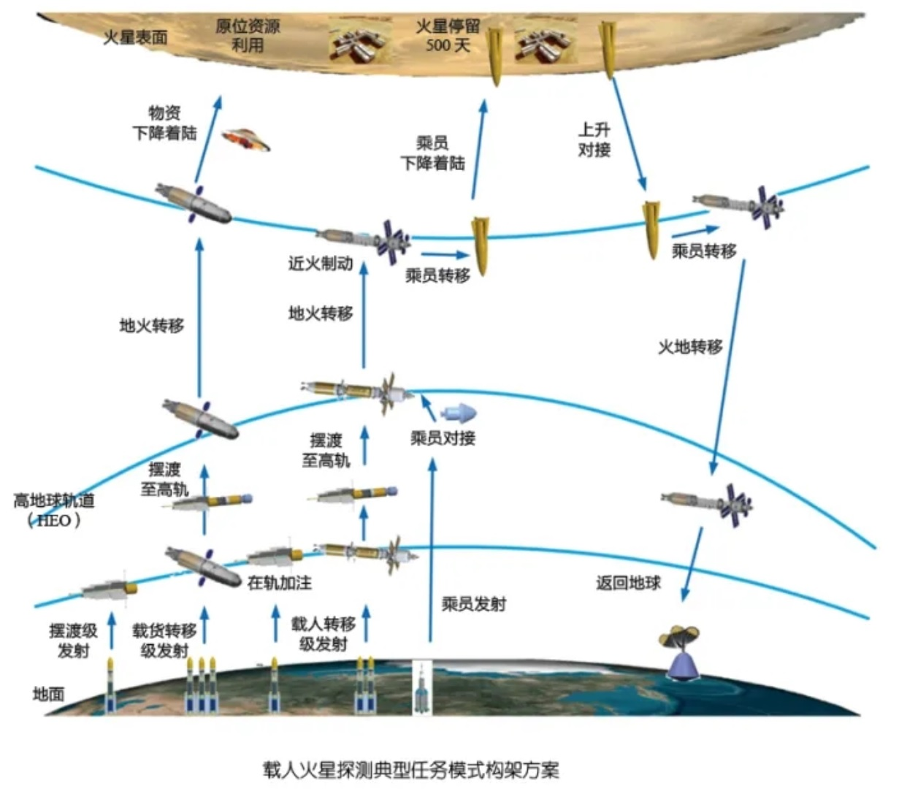

- 星期一，苏州阵雨转阴23-27度
- 关于推荐算法
  collapsed:: true
	- [今日头条、抖音推荐算法原理全文详解！_程序员小乐的博客-CSDN博客](https://blog.csdn.net/xiaoxiaole0313/article/details/104809884)
	- [新浪热门微博的热度排序算法是怎样的？ - 知乎](https://www.zhihu.com/question/21930083/answer/37581321)
	- [抖音推荐算法详解（附流程图） - 知乎](https://zhuanlan.zhihu.com/p/363246309?ivk_sa=1024320u)
- SmartKG可以构建知识图谱，构建后可以通过提问的方式获得答案。
- ((6305f16c-8032-44c7-b090-fe36f866727a))
- [抹黑中国文物追索的美国GQ文章，要被华纳兄弟找华裔改编成电影](https://www.guancha.cn/internation/2021_08_18_603492.shtml)
  collapsed:: true
	- 据《好莱坞记者报》当地时间（2021年）8月17日消息，华纳兄弟将打造一部聚焦前几年中国海外流失文物在欧洲频繁失窃事件的电影，包括导演朱浩伟、编剧欧阳万成、编剧杰西卡·高和编剧Ken Cheng在内的主创均为华裔。
	- 值得注意的是，电影改编自美国《GQ》杂志2018年发表的文章《中国艺术品大劫案》（The Great Chinese Art Heist），作者强行将近年来一些欧洲博物馆文物的失窃案与中国政府挂钩，暗示中国不惜一切手段追回海外流失文物，抹黑中国收藏家和文物研究员，通篇污名化中国文物追索。
	- 早在2018年，该文中提到的不少中国文物收藏界人士就对其中说法提出了质疑，然而，3年后，华纳兄弟却找了一群华裔来把这篇文章改编成电影。
- [国家拟设立国民养老保险股份有限公司，注册资本超111亿](https://www.guancha.cn/politics/2021_08_19_603612.shtml)
  collapsed:: true
	- 2020年末，中央经济工作会议将规范发展第三支柱养老保险改革作为今年经济工作的一项重要任务。今年2月，人力资源和社会保障部（下称“人社部”）副部长游钧在国新办发布会上表示，养老保险第三层次制度已经形成了初步思路。总的考虑是，建立以账户制为基础、个人自愿参加、国家财政从税收上给予支持，资金形成市场化投资运营的个人养老金制度。
	- 简而言之，在账户制之下，税收政策享有主体是账户持有人，载体是账户而不是产品，让账户持有人能够用一个账户“通吃”所有合格金融产品，以提高第三支柱的便利性和可及性。
	- 在操作层面，参加人建立个人养老金账户，在工作期间按期向账户缴款，国家对一定额度的缴费给予税收优惠，在个人应税收入中予以扣除，这部分缴费暂时免于缴纳个人所得税。个人可决定将账户资金委托投资，市场机构通过长期投资，增加账户积累，个人在退休时开始从账户提取年金，补充自己的养老金，提取金额纳入个人收入计税。
- [重磅 | 印学者：伏击海上交通线恐是印度打垮中国的唯一机会_风闻](https://user.guancha.cn/main/content?id=574692)
  collapsed:: true
	- **中国军队在陆地上是坚不可摧的，他们唯一的战略弱点是其70%的石油进口需要经过印度洋的海上航道。**
	- **确保中国“不采取侵略行为”的唯一途径，就是精心策划对中国油轮的威胁，并让印度海军完全掌控因此而升级的局势。**首先，要承认中印两国间存在实力不对称，并通过军事革命来抵消数量劣势的后果。其次，**印度要将包括南中国海和东印度洋在内的印太地区，划进四国集团的海上搜寻责任区域，并将安达曼尼科巴群岛的布莱尔港（Port Blair）或安德拉邦的维沙卡帕特南（Visakhapatnam）作为所有国家通信及报告平台的中心。**这样一来，四国集团的海上搜寻飞机将获得印太地区上空的信息主导权，得知中国海军穿越马六甲海峡的所有行动计划。**印度海军可以逮捕所有驶往中国的油轮，将它们扣押在尼科巴群岛（Nicobar）附近的检疫锚地。**此时，印度就可以发表外交声明称“印度保留选择报复时间和地点的权利”，并向四国集团的其他成员国发出警报。
	- 这时，印度可以把被扣押的油轮作为诱饵，引导对手前来与印度海军交战。**四国集团的资源共享可以将敌方的军队动向提前几天通报给已经埋伏好的印度军队。**最后，敌方海军将穿过狭窄的海峡进入军事战术中的“杀戮之地”。如果印度能进一步建设完善卡尔尼科巴空军基地，长期部署一只飞行中队，就将使这一行动三管齐下，并获得最大收益。不仅如此，**一旦印度空军能够放弃其领空防御思维开始远征，我们就可以与阿曼谈判，利用位于马西拉岛（Masirah）的旧英国空军基地控制霍尔木兹湾，威胁中国在吉布提的基地。**
- 中国载人登火计划
  collapsed:: true
	- 
- [我在国外待了十多年，接触过各个国家的人后，我很少去用争论改变他们的想法_风闻](https://user.guancha.cn/main/content?id=574934&s=fwzxhfbt)
  collapsed:: true
	- 【本文来自[《无论是谁去，阿富汗都很难变成文明社会？》](https://user.guancha.cn/main/content?id=573193)评论区，标题为小编添加】
	- 自从我在国外呆了十多年，接触过各个国家的人以后，我就很少尝试去用争论改变他们的想法。我觉得每个国家和民族的行事，有他自己背后错综复杂的原因，争辩什么的并不能改变根源。
	- 所以我不会和狂热的华人教徒争论是否应该信仰基督，即便我觉得华人教会问题极大，而这些移民有可能是因为皈依者方面的心理因素才信基督。
	- 我也不会和马来西亚的华人争论伊斯兰教问题，尽管我觉得伊斯兰教问题也很大，马来西亚也不太像一个适合华人出头的社会形态。
	- 我也没有和我的台湾室友争论过统合问题。俄罗斯移民谈论他在前苏联遭遇的时候我不会发表意见讨论苏联解体是利是弊，伊朗移民谈论千辛万苦移民美国的时候我不会讨论美伊紧张的时候他做这种决定是对是错，黑人同事痛骂特朗普的时候我也不会讨论他当选的必然性。
	- 跨文化的交谈中我是聆听者，因为我感觉言语是没有意义的，每一个人、每一个社会都有它的背景文化和进程，某方面来说，可以被摧毁却不会轻易改变。
	- 所以阿富汗要变成文明社会，并不是“谁谁谁”能够带给他的，而是他自己内部运转更替形成的。外部给他的力只能加速或者减速甚至中断、倒退这个过程，却不会“一日之间”让它变成另一个“文明”形态。并且，对于阿富汗这样有着悠久历史的国家，另一个文明的形态真的就更好吗？
	- [fcfs](https://user.guancha.cn/user/personal-homepage?uid=9373) 的评论
		- 归根到底是你是否对论题有彻底认识的问题。“批判的武器当然不能代替武器的批判，物质力量只能用物质力量来摧毁，但是理论一经掌握群众，也会变成物质力量。理论只要说服人，就能掌握群众；而理论只要彻底，就能说服人。所谓彻底,就是抓住事物的根本。”
	- [割草机88](https://user.guancha.cn/user/personal-homepage?uid=19455) 的评论
		- 对，争论本身是争不出结果的。。等事实清晰明朗化后结果就自然显现了。国力比较，战争胜负，科技先进等等。
		  但是这是聪明人之间的默契，普通人不是这样的，你沉默了，对方就当你理亏心虚了。中国人中的聪明人多，文化传统中又有这种智慧，导致中国人在国外总是沉默的一方，于是反而被普遍欺负。。
		  其实想想黑人和阿三，整天吵吵嚷嚷的，尽管没卵用，但别人至少不会轻易去惹他们。。
- 成长的瞬间 #科幻 #故事灵感 #不存在科幻 #微小说
  collapsed:: true
	- 《新福音战士剧场版：终》播出了。真嗣长大了，我们也一样。
	  成长，经常是一瞬间的事。【在300字以内，构思一个有关“成长的瞬间”的科幻故事】
	- 经过漫长而艰辛的战斗，从明天起，我们开始统治这个伟大的国家。我们围坐在火堆旁开始讨论接下来的施政策略。
	  “统帅，那个四世纪的雕像是曾经侵略我们的文明的遗产，您决心要推倒它吗？”一个忠诚的同僚提问。
	  “是的，它冒犯了我们的信仰。”
	  “统帅，我们收的税放在哪里，我们还没有收税机关和银行。”另一个可靠的伙伴发问。
	  “那玩意我们还不知道怎么建设，收拢的税金先放在各自的床底吧。”我建议道。
	  “统帅，我们在占领的府邸发现了一台机器，我们的语言学专家说它可以计算出20年后的未来，我们要试试吗？”我那坚定的支持者问。
	  需要这样的机器吗，我陷入深思。我们的族群只占这个国家的四成，二十年后各族人民都将获得幸福，并成为我们的支持者，我们彼此不同却彼此相亲相爱。二十年后，我们有军事部，有各种武器保卫我们的国家，有财政部统筹军事的支出，还有支持民生的各种机构，支撑这些的都是普通人。二十年后，我已经死去，人民才是真正的统帅。
	  “我们，咳咳”，我清了下嗓子，“感谢您委婉的建议。文明的遗产不需要清理，我们需要知识，更多的知识。我们需要深入民众，理解并尊重他们的不同。明天将是新的时代，不是我们的时代，是人民的时代。”他们或许不能理解我想到了怎样的理解，或许我也不能，但就是这么神奇，我找到了那条路。
- 阿富汗人的命运
  collapsed:: true
	- **阶级分析**
	- 不同的民族构成，亲中东伊斯兰势力，亲中亚中俄势力，亲西方势力
	- 旧政府政治官员，旧政府技术官员，军阀政治势力，国际非政府组织影响的群体，流亡难民，回归的难民，农业手工业生产者，城市商人，
	- **为什么要知道他们的命运**
	- 人道主义关怀
	- 实现中国的目的：1 新疆的安定 2 更好实现一带一路战略
	- 最好的结果：建立稳定的政府，压制了内战的火苗，国际社会承认政权合法性，联合国进行人道主义救援，大国投资建设
	- 最差的结果：陷入军阀混战，周边国家涌入难民潮，滋生恐怖主义
	- 影响结果的因素：不同政治势力政见统一或分裂，外部大国干涉或援助，联合国干涉或援助，不同民族人民被统一或被分裂，难民回归或增加，农业生产资料，矿藏，
	- **达成最好结果的条件**
	- 不同政治势力被统一，外国大国无干涉或干涉被破坏，联合国和其它国家提供援助，不同民族被统一，难民回归，农业种植养活了一半的人口，合作开发矿产资源，参与一带一路开发养活另一半人
	- **形成最坏结果的条件**
	- 不同政治势力无法被统一，外国势力干涉不同政治势力引发内战，无国际援助，不同民族更加分裂不认同单一势力，内战产生了大量的难民，难民加入了恐怖组织
- 百妖谱 #科幻 #故事灵感
  collapsed:: true
	- 未来局接待员:
	  [链接]有六只腕足的海底人，决定寻找太阳 | 科幻小说
	- 未来局接待员:
	  今天这篇小说讲述了两位海洋文明的勇士，发现新的世界的故事~欢迎在评论区留言，优质留言会登上每周日的推送哟！
	- Deciia:
	  碗上女子，是金鱼还是莲蓬成妖？
	- 百妖谱里的妖怪就好像刚训练的人工智能
	- 看人世数百年，为什么没有看透人世的复杂
	- 怎样用科技的方法让一个从婴儿起长大的相信万物可化妖，人也是妖怪
	- 不存在-致远:
	  百妖谱？
	- 感觉难度比较大，存不存在都不能证明
	- Deciia:
	  刚看到化蛇
	- 不存在-致远:
	  小说绘上的小说都这副德行
	- 尤其是以前上面连载的奇幻小说，现在想起来特别中二。
	- 后来就只看《科幻世界》和《作文素材》了
	- Deciia:
	  这就是市场找到了你，随后你离开了那个市场。
	- 让海底人看到曙光，在万物生妖怪的世界看到两个妖怪在一起了……
	- 然后他们生下了人
	- 想到十二国记，人是树上结出来的果实，科技发展多少年后，有一种树上面吊着人造子宫……又或者那个孩子看到的万物实际上都是一个或移动或静放的子宫
	- 不存在-致远:
	  其实，我觉得《罗小黑战记》挺好的，你看过吗？
	- Alex徐:
	  非常不错
	- Deciia:
	  人工培育出来的生物，他们一开始伪装成动物，植物，或者非生物，然后功德圆满破茧成蝶化成“妖怪”
	- 嗯 看过电影版
	- Alex徐:
	  [图片]
- 非线性写作 #写作
  collapsed:: true
	- Deciia:
	- [刘慈欣进化史 - 知乎](https://zhuanlan.zhihu.com/p/22319337)
	- 卮言:
	  1985哇，22岁第一个短篇，40多岁才写的三体，那我24岁没写短篇直接干长篇，是不是不太好
	- 不过我还是坚信将来的科学观一定是非线性和复杂性的，不过现在很欠缺这种科幻故事，那还是我自己慢慢写吧。希望随着中国的崛起，这种故事能更多
	- A 比坊梦 王天佑 13614926893:
	  兄弟，我现在写的就是非线性和复杂性的开放世界
	- 你可以帮我续写一下，或者我们互相交流也可以，我这边直接用CC协议了，所以你可以放心
	- [《蔓生湮灭》](https://guhhhhaa.gitbook.io/-1/)
	- 卮言:
	  豆瓣吗
	- A 比坊梦 王天佑 13614926893:
	  gitbook
	- Alex徐:
	  @卮言 很多大作家是时代造就的，没有TVB，可能也没有那么火的金庸和武侠。没有西方的电影工业，西方科幻或许不见得能引领全球科幻。也许现今是中国科幻最好的时代。
	- A 比坊梦 王天佑 13614926893:
	  豆瓣已经解约了
	- Alex徐:
	  @卮言 看好你
	- 卮言:
	- 你这是开放故事吗，多人一起写的？
	- A 比坊梦 王天佑 13614926893:
	  开放世界，现在是我一个人写
	- 卮言:
	  哈哈，我先把地球篇写完，以后跟你联动一下
	- A 比坊梦 王天佑 13614926893:
	  以后准备用人工智能写
	- 卮言:
	  网站做的挺好
	- xx峻:
	  人工智能写作软件早就有了，根据故事线，和网络素材，自动生成一篇文章或小说。
	  但这种东西永远会有瑕疵，不可能超越人类原创。
	- 为什么呢？答案就在我下一部小说中会出现……在这里暂不详说！
	- Deciia:
	  不知道人工智能在写故事时，是否同时虚构出一个幻境，他们也看到了正在开拓的故事宇宙，然后有一天，人类说“小爱，写个故事吧”，但实际上人类只是想偷偷的看小爱的故事宇宙
	- 写作者在写作时，大脑中应该有一幅漂亮的画卷
- 五星连珠 #聊天记录 #不存在科幻
  collapsed:: true
	- 太空无垠:
	  今晚五星连珠
	- 工藤新一:
	  我想穿越到2008年
	- 卮言:
	  [动画表情]
	- Deciia:
	  晚上好，天黑了，大家可以出来行动了
	- Deciia:
	  抓到一只小可爱，
	  又抓到一只，
	  月亮出来了，
	  原来是……
	- 飞雪:
	  [图片]
	- 未来局接待员:
	  [链接]我们主角团正需要你这样的伙伴！| 科幻微小说
	- 未来局接待员:
	  本周微小说的主题是【成长的瞬间】~每周一在社群里公布微小说主题，开放参与哦！
	- Deciia:
	  原来你们是金星木星水星火星土星
	- Alex徐:
	  早
	- Deciia:
	  早安派大星，早安海绵宝宝，早安加菲猫，早安蜡笔小新，早安小丸子，早安图图，早安，我的朋友o ￣▽￣ ブ
	- Deciia:
	  早安，古德猫宁，早安，阿福特努，早安，伊芙宁，早安，奈特。
	- 卮言:
	  玛卡巴卡