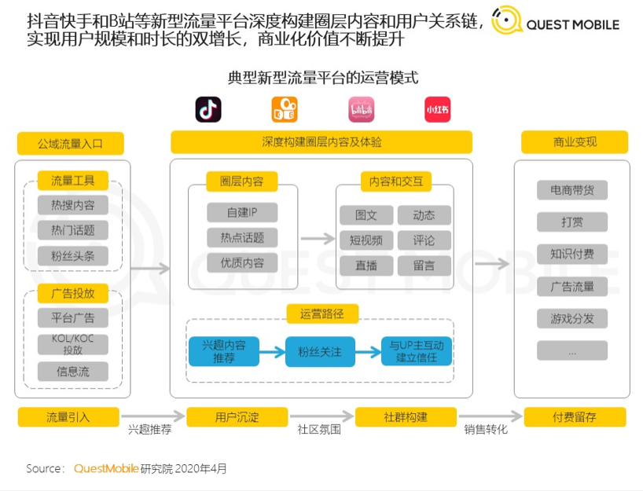

- 星期六，苏州阴转多云26-30度
- 典型流量平台运营模式 #产品
  collapsed:: true
	- [B站收到了一个危险信号-虎嗅网](https://www.huxiu.com/article/449922.html)
		- 
- [商务部：明年中国外贸形势可能很严峻，外贸企业“四难”凸显](https://www.guancha.cn/politics/2021_08_23_604031.shtml)
  collapsed:: true
	- 稳增长，主要是稳主体、稳订单。现在我们还面临一些困难，这也是国际上普遍遇到的，比如运力的影响和运费的高涨，**大宗商品、原材料的上涨，还有人民币汇率升值的压力，劳动力成本的提高，这些是外贸企业碰到的“四难”，**特别是中小企业更加困难，所以要采取一系列措施稳住市场主体、稳住订单。
	- 促创新，除了传统外贸外现在还大力推进外贸新业态、新模式发展，比如跨境电商，支持高技术、高质量、高附加值产品的出口，加大中国品牌的海外推介力度。
	- 保畅通，保证我们的外贸产业链、供应链畅通。
	- 扩合作，时间关系就不展开了，就是深化国际经贸合作。王受文副部长刚才回答大家问题的时候讲到，维护多边贸易体制，商签自贸协定、升级自贸协定，更深地融入到整个国际经济合作当中，既对世界的发展作出我们的贡献，也促进我们自身外贸的发展。
- 黑神话 悟空，即见未来，为何不拜 #游戏
  collapsed:: true
	- [《黑神话：悟空》最好的归宿就是做不出来？-虎嗅网](https://www.huxiu.com/article/450272.html)
		- 之所以大家都一门心思将注意力放在手游上，因为市场决定了这就是最主流的职业成长路线，这里有比较明确的晋升路径，行业机会，通用的技能点数。
		- 而3A牛逼，但规模小，从业者也少，在国内就更是微不足道，大家埋头吃饭就好。而对游戏品质都可以归咎于是市场的选择、是监管的严苛、反正大家都做适应性产品，主要是做好服务。
		- 这就像本来寝室里都在打lol，大家都等着毕业了找个厂上班，对面学校有人考研与我何干。但忽然你的上铺说不行，老子要考研，然后挑灯夜读，复习还做得贼好。
		- 不管他有没有考上，当下大家打lol时都容易感觉虚无。**我在我的蚊帐里BAN人，你却在你的蚊帐里翻书。**
		- 你考研做得越到位，虚无感就越强烈。
		- 当然了，这种虚无的情绪过去的也很快，lol还是要打的。
		- 但是从此多了一个念想：他要是没考上就更好了，我既打了lol，他又白费了力气，我们的出路又是一样。
		- 这种心态的怪话就像是这样。
	- [《黑神话：悟空》实机演示刷屏了，我却隐隐有些担心-虎嗅网](https://www.huxiu.com/article/450124.html)
		- 踏过三界宝刹，阅过四洲繁华。
		- 笑过五蕴痴缠，舍过六根牵挂。
		- 为情义披战甲，为爱人挑担、牵马、送晚霞。
		- 怕什么欲念不休，怕什么浪迹天涯。
		- 步履不停，便是得救之法。
		- ——敢问路在何方？路在脚下。
- 阿拉伯世界知识 #文化
  collapsed:: true
	- 谢赫（小酋长）—埃米尔（大酋长）—苏丹（国王）—哈里发（帝王）
	- [阿富汗伊斯兰酋长国的酋长国，究竟是什么国？_风闻](https://user.guancha.cn/main/content?id=576465)
- 什么是颠覆式技术？
  collapsed:: true
	- [科技部向全社会征集颠覆性技术研发方向](https://www.guancha.cn/politics/2021_08_20_603803.shtml)
	- [科技部办公厅关于开展颠覆性技术研发方向建议征集工作的通知-中华人民共和国科学技术部](https://www.most.gov.cn/xxgk/xinxifenlei/fdzdgknr/qtwj/qtwj2021/202108/t20210819_176486.html)
	- [如何看待科技部向全社会征集颠覆性技术研发方向？你有什么脑洞呢？ - 知乎](https://www.zhihu.com/question/481220643)
	- 本次建议征集，瞄准经济社会高质量发展的重大科技需求，强化问题导向和目标导向，突出颠覆性技术突破性、产业变革性，巨大市场潜力等特性，重点征集可能在未来一段时间内产生重大突破，并能够带来产业升级换代或具有巨大市场潜力的颠覆性技术。
	- 本次建议征集，请从以下几个方面进行详细说明：“颠覆性技术介绍”、“颠覆性技术研究现状”、“为什么是颠覆性技术”、“技术解决的主要问题”、“颠覆影响力”、“主要应用场景与市场规模”等。
	- 请在深入调研、认真思考的基础上，尽可能详细准确地填写好征集信息表。您的意见或建议将作为我们开展后续工作的重要参考。
	- **三、征集方式和其他注意事项**
	- 1.本次选题征集以无纸化方式进行，请登录国家科技管理信息系统（[http://service.most.gov.cn](http://service.most.gov.cn)）颠覆性技术研发方向建议征集专区，在线填写征集信息表。
	- 2.**颠覆性技术研发方向建议征集专区长期面向企事业单位和社会公众开放。**
	- 3.如您在填写过程中有任何疑问，欢迎咨询xmzj@istic.ac.cn。
- [科幻写作入门](https://mp.weixin.qq.com/mp/homepage?__biz=Mzg2NTA1ODQ5OQ==&hid=14&sn=7686cd4a5d85bed5fa001a243f3b4f5d)
- 一个火星年分为24个月，每6个月的最初5个月的长度为28火星日，其余为27火星日（也就是6月、12月、18月为27天）。而最后一个月（24月），如果是闰年就是28个火星日，平年则为27个火星日。
- APP隐私 #产品
  collapsed:: true
	- [关于印发《常见类型移动互联网应用程序必要个人信息范围规定》的通知-中共中央网络安全和信息化委员会办公室](http://www.cac.gov.cn/2021-03/22/c_1617990997054277.htm)
	- [1124853418_15652571749671n.pdf](http://www.cac.gov.cn/1124853418_15652571749671n.pdf)
	- [专家解读｜个人信息保护法：为数字社会治理与数字经济发展构建基本法-中共中央网络安全和信息化委员会办公室](http://www.cac.gov.cn/2021-08/25/c_1631491548474109.htm)
	- [App能提取哪些个人信息？一张图明了-中共中央网络安全和信息化委员会办公室](http://www.cac.gov.cn/2021-04/07/c_1619372898054768.htm)
	- [APP收集个人隐私要划清边界-中共中央网络安全和信息化委员会办公室](http://www.cac.gov.cn/2019-08/21/c_1124902743.htm)
- 996是否违法
  collapsed:: true
	- [人社部、最高法联合发布超时加班劳动人事争议典型案例，明确工时及加班法律适用标准，有哪些信息值得关注？ - 知乎](https://www.zhihu.com/question/482582774)
- 互联网信息服务算法推荐管理规定
  collapsed:: true
	- [国家网信办：禁止PUSH弹窗推送八卦绯闻等内容](https://www.guancha.cn/politics/2021_08_27_604750.shtml)
	- [国家网信办关于《互联网信息服务算法推荐管理规定（征求意见稿）》公开征求意见的通知](https://www.guancha.cn/politics/2021_08_27_604671.shtml)
- #card 忒修斯之船
  collapsed:: true
	- **特修斯之船（又译为忒修斯之船）**亦称为**忒修斯悖论**，是一种有关身份更替的悖论。假定某物体的构成要素被置换后，但它依旧是原来的物体吗？
	- 公元1世纪的时候[普鲁塔克](https://baike.baidu.com/item/%E6%99%AE%E9%B2%81%E5%A1%94%E5%85%8B/4528267)提出一个问题：如果忒修斯的船上的木头被逐渐替换，直到所有的木头都不是原来的木头，那这艘船还是原来的那艘船吗？因此这类问题现在被称作“忒修斯之船”的问题。有些哲学家认为是同一物体，有些哲学家认为不是。在[普鲁塔克](https://baike.baidu.com/item/%E6%99%AE%E9%B2%81%E5%A1%94%E5%85%8B/4528267)之前，[赫拉克利特](https://baike.baidu.com/item/%E8%B5%AB%E6%8B%89%E5%85%8B%E5%88%A9%E7%89%B9/440484)、[苏格拉底](https://baike.baidu.com/item/%E8%8B%8F%E6%A0%BC%E6%8B%89%E5%BA%95/12690)、[柏拉图](https://baike.baidu.com/item/%E6%9F%8F%E6%8B%89%E5%9B%BE/85471)都曾经讨论过相似的问题。近代[霍布斯](https://baike.baidu.com/item/%E9%9C%8D%E5%B8%83%E6%96%AF/649408)和[洛克](https://baike.baidu.com/item/%E6%B4%9B%E5%85%8B/8574982)也讨论过该问题。这个问题的有许多变种，如“祖父的旧斧头”。
- 游戏式善良
  collapsed:: true
	- [美军空袭喀布尔致 9 人丧生，6 名儿童遇难，多辆车被炸毁 ，还有哪些信息值得关注？ - Mr Poopybutthole的回答 - 知乎](https://www.zhihu.com/question/483420943/answer/2092762445)
	  collapsed:: true
		- 这个事情很恐怖，比下图背后的故事恐怖 100 倍，但是如果没有这样一张照片，就无法触动美国一般人的神经。
		- 而这种照片是不会流出来的。
		- 美国人的善良是 “游戏式善良”。
		- 我解释一下这个名词，如果你玩过任何 RPG 类型的游戏，你就知道里面有很多做善事的小任务。比如扶老奶奶过马路，帮村民找到走失的驴子之类的。
		- 但是游戏设计里面有这样一个难题，即无法让玩家做到 “真正的善良”，即，这些任务都有实际的物质奖励 -- 一个成就，一件装备，一些游戏内货币，一些经验值，如果去掉这些奖励，玩家根本就不会做这些 “善事”。这是一种“功利性善良”，真实世界的善良的“功利性” 其实是很低的，越是 “深藏功与名” 的善良越收到鼓励，绝大部分的 “善举” 甚至是有代价的。而游戏中，玩家不仅仅期待 “好人的好报”，收不到还会骂骂咧咧，甚至很多玩家做完“善事” 拿到任务奖励，转头就屠了给任务的 NPC。
		- 最近比较火的电影《失控玩家》里面有这样一个设定，一个类似 GTAV 的游戏里 NPC 突然有了自我意识，开始像玩家一样升级，一开始其他玩家并没有意识到他是 NPC，而认为他的其他玩家。这个 “玩家” 非常的与众不同，他在游戏里居然从来不做坏事！只通过做好事来升级。这瞬间成为热门话题，网红 youtuber 和 twitch 大主播一时间都在谈论：怎么可能有人一直做好事呢？
		- 这个设定其实暴露了电影制作人对游戏玩家这一群体的无知 -- 其实在游戏里面 “扮老好人”，只做善事的游玩风格并不罕见，很多入戏的玩家选择了“守序善良” 阵营就会绝对按照人设来办事，这绝对没有什么话题性。但是这种 “善良” 依然不是真正的善良，而是功利性的善良，或者说 “扮演出来的善良”。很多人会“守序善良” 玩一周目，“混乱邪恶”玩二周目。
		- 游戏中最接近让玩家 “真正做好事” 的设计是 Nier Automata 的结尾 -- 故事的结尾是一个 Bullet hell 游戏，弹幕会变得越来越密集，最后变成不可能完成的任务，你会坠机。坠机后你会收到信息：其他玩家提出帮助，是否接受？按接受之后，主题曲从独唱改为合唱，一圈飞机飞出来保护你，而这些飞机会不断坠毁，每坠毁一架，屏幕上会显示 XXX（真实玩家姓名）的数据已丢失，还有会有一段来自这个玩家鼓励你继续下去的话语。当你最后通关时，游戏会问你：在其他玩家的保护下，你看到了 Nier Automata 的结尾，你愿意传递这份善意吗？如果你选择 “是”，你可以留下一句鼓励其他玩家的话语，随后游戏会删除你的存档。这样的设计让玩家在“决定做善事” 的情况下遭受了“真实的损失”，所以是游戏设计上很大的创新。
		- 当然这个设计本身还是有些问题，因为你要选择 “接受”，那么一定会看到结尾，不管外部有多少人选择帮你，而选择帮助别人的信息也有可能被 recycle，而“真实的损失” 也可以被规避，比如刷完全成就再去看这个结尾。
		- 而真正需要玩家善意的任务设计，《合金装备 5》全服务器的玩家解除核武装，而这是一个不可能达到的任务，是小岛秀夫对玩家的嘲讽。
		- 回到题目，为什么我说美国人的善良是游戏式善良？一开始接触美国人或者美国的文娱作品，会感觉这个社会道德情操很高，久而久之发现，这种善良其实是有条件的，大多数情况下，这些外人 “肉眼可见” 善良必然是隔岸观火的，必然是自己不遭受损失的，必然是充满自我感动的。即所谓的 “白左之善”。游戏玩家不能共情本质是 0 和 1 的 NPC，所以不能真正在 “游戏中行善” 是正常的，这是游戏机制的固有缺陷，但是美国乃至西方整体，对于有血有肉的人类，展现的都是这种 “数字伪善” 那真的是让人毛骨悚然了。
		- 当然我不是说美国人都是 SOB，真正善良的美国人当然存在，也很多，只是这些善意你看不见，例如早期互联网的分享精神，那就是一种纯粹的 “善”。但是统治阶级掌握互联网之后，这种真正的善良就被淹没了，被统治阶级的“伪善” 代替了。西方媒体几十年如一日对非西方进行 “非人化” 处理的遗毒已经非常深刻，在它们熏陶下，西方民众中普遍的 “平庸的恶” 已经无法忽视
- 人类的朋友们 #科幻 #故事灵感 #不存在科幻
  collapsed:: true
	- 未来局接待员:
	  从动物到机器人，从一本书到一段代码，人类的朋友们千奇百怪。
	- 【在300字以内，构思一个有关“人类的朋友们”的科幻故事】注意！超字数是不会上墙的哦~
	- 参与方式：8月24日下午4点以前，直接将你的小说发在群内，前加#人类的朋友们#tag
	- 8月25日晚上，接待员会挑选优秀作品，放在推送中。期待看到各位的作品，递笔~
	- Deciia:
	  十年前，我见到了它，之后它一直在陪伴着我。
	  一年后我参加了它和我的一位朋友的婚礼，之后他们生下了一对双胞胎。
	  在一次战斗后我离开了人世，在前往地狱的大门前，再次见到了祂，因为等不到我，所在前往人间陪我走了一遭。
	  日复一日。苍蝇大军铺天盖地，轮到蚊子云。千牛队卷起千堆雪，大象阵刮起一阵风。繁星斗转，日月奔走。机器人眼睛越加越多，搜索AI疯狂运转。人类的朋友们在地壳上凿出了一片洞中海洋，叠浪似在低语，你在哪里，人类的朋友们？回应他们的，只有他们自己的心声，这心声汇聚成海，这海激荡出一个声音。一只蚊子看向自己，我又是谁？
- 集体潜意识 #故事灵感 #聊天记录
  collapsed:: true
	- Deciia:
	  人类集体潜意识可以与甲虫连接吗，可以与水杯连接吗，可以与手机连接吗，可以与电脑连接吗，可以与布娃娃连接吗，可以与泥像连接吗？
	  只能与人类连接吗？什么可以作为中介，从而可以与手机连接呢？什么可以作为中介，与某种人工智能连接呢？
	  人类集体潜意识连接交换信息是在哪里发生的呢，在什么地方缓存，保存在什么地方，影响范围有多大，支持潜意识海洋的运算核心在哪里，由受影响的人类独立分配出一部分计算资源吗？
	- Deciia:
	  一个受控对象连接3个脑机，受控对象应该怎么运动，3个脑机应该怎么协作，是否有主脑机，是否有外部辅助AI，受控对象是否可以有某方面的智能与脑机、辅助AI协作
	- Deciia:
	  如果3个脑机，辅助AI，受对对象自主智能形成了一个潜意识空间，里面存储了大量的有效指令、无效指令，这个潜意识空间是否有可能诞生独立完整的人工智能，从而可以控制受控对象行动