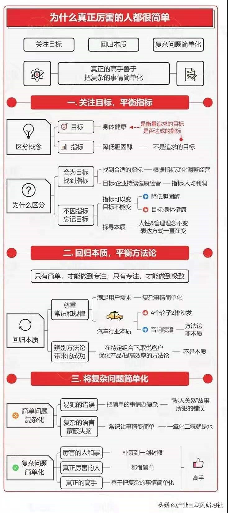

- 关注目标，平衡指标 #思维导图
  collapsed:: true
	- 
- 本地图床 #工具 #图床
  collapsed:: true
	- 【【本地图床搭建】自建稳定、免费、开源的可迁移本地图床，配合Picgo实现Zotero、Obsidian、Typora等Markdown图片笔记-哔哩哔哩】 https://b23.tv/qAMoIir
	- {{bilibili https://www.bilibili.com/video/BV16S4y1v7Kb}}
	- 视频笔记  
	  collapsed:: true
		- 学完不要忘记三连哦!
		- 1.所需文件网盘链接：https://wwd.lanzouj.com/b03j28azi 密码:hio4  
		  （文件夹里版Picgo https://wwd.lanzouj.com/iJscG06tfu2d 密码:3jqd）
			- 1.先下载网盘里的替换文件按视频替换之后Picgo中填写；  
			  2.API地址填写 http://127.0.0.1:8888/local_pic_host  
			  3.POST参数名填 file  
			  4.JSON路径填 file_data
		- 2.My-Easy-Pic-Bed-main项目地址：https://github.com/fslongjin/My-Easy-Pic-Bed
		- 3.快捷方式粘贴进 `C:\ProgramData\Microsoft\Windows\Start Menu\Programs\Startup` 中即可开机自启
		- 4.[Picgo项目地址](https://github.com/PicGo/Awesome-PicGo)，[Molunerfinn/PicGo](https://github.com/Molunerfinn/PicGo)
		- 5.quicker官网：  
		  https://getquicker.net/
		- {{renderer(:media-timestamp,00:43)}}
			- 介绍及具体配置方法
	- picgo使用  
	  collapsed:: true
		- [PicGo](https://picgo.github.io/PicGo-Doc/)
		- 感觉暂时用不到
- 绘画资源 #资源
  collapsed:: true
	- 课代表来啦，顶一顶  
	  1、故宫名画记  
	  http://minghuaji.dpm.org.cn/  
	  2、Screenmusings  
	  https://screenmusings.org/?ref=sotuw.com  
	  3、Behance  
	  https://www.behance.net/  
	  4、芝加哥美术馆  
	  www.artic.edu/collection  
	  5、costumersguide  
	  http://costumersguide.com/  
	  6、世界名全景照片  
	  http://cn.airpano.com/  
	  7、人体动态参考  
	  https://www.bodiesinmotion.photo/  
	  8、pixelsquid  
	  https://www.pixelsquid.com/png/china  
	  9、Mangapose  
	  http://www.mangapose.com/10、Freepik  
	  10、ello  
	  https://ello.co/  
	  【色彩搭配网站】  
	  11、coolors  
	  https://coolors.co/  
	  12、中国传统配色网  
	  http://zhongguose.com/  
	  13、Nipponcolors  
	  https://nipponcolors.com/  
	  14、WebGradients  
	  https://webgradients.com/  
	  15、Design Seeds  
	  https://www.design-seeds.com/  
	  16、ColorHunt  
	  https://colorhunt.co/  
	  17、BrandColors ：  
	  http://brandcolors.net/  
	  18、Adobe Color CC  ：  
	  https://color.adobe.com/zh/create  
	  19、Illustrationage  
	  https://illustrationage.com/  
	  20、Artstation  
	  https://www.artstation.com/  
	  21、LOFTER  
	  http://www.lofter.com  
	  22、DeviantArt:  
	  https://www.deviantart.com