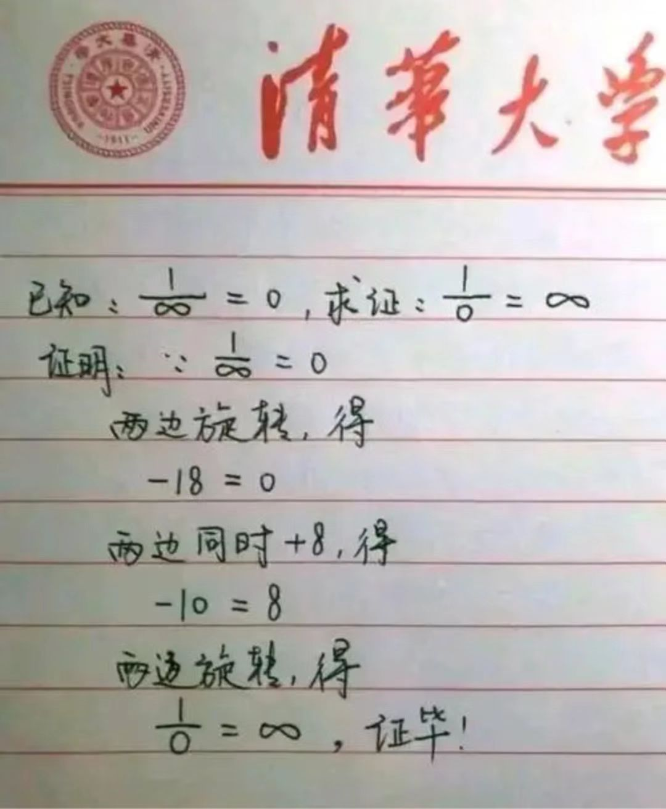

- ## 今日阅读
	- 图片素材获取
		- 资源网站
			- [白嫖合集——52个免费素材网站 - 知乎](https://zhuanlan.zhihu.com/p/436396429)
			- [20个超高质量、超全的可商用免费插画网站合集！](https://view.inews.qq.com/a/20220613A0A33R00)
			- [龙飞凤舞 L_人文艺术图片素材_水公的画板-花瓣网](https://huaban.com/boards/13626393)
		- AI 图片生成
		  id:: 6308773f-3bdd-4cff-bdc1-d008913f9b52
			- Stable Diffusion
				- {{bilibili https://www.bilibili.com/video/BV14d4y1d7zt}}
				- [DreamStudio](https://beta.dreamstudio.ai/dream)
				  collapsed:: true
					- 目前免费，需要注册
					- **提示指南**
					  collapsed:: true
						- ## Basics of Prompt Engineering
						- ### A guide by   [Graverman](https://twitter.com/dailystablediff)
						- Today I propose a simple formula for beginners to use and create better generations with text to image AI. This was tested on stable diffusion but it should work on any model if it was trained on enough art data.
						- After reading this document and applying these simple steps, you’ll be able to generate better images with the same amount of effort.
						- ### 1. Raw prompt
						- Raw prompt is the simplest way of describing what you want to generate, for instance;
							- Panda
							- A warrior with a sword
							- Skeleton
						- This is the basic building block of any prompt. Most new people start by only using raw prompts, this is usually a mistake as the images you generate like this tend to get random and chaotic. Here are some examples that I generated with running the earlier prompts
						- 
						  
						  As you can see, these images have random scenery and don’t look very aesthetically pleasing, I definitely wouldn’t consider them art. This brings me to my next point;
						- ### 2. Style
						- Style is a crucial part of the prompt. The AI, when missing a specified style, usually chooses the one it has seen the most in related images, for example, if I generated landscape, it would probably generate realistic or oil painting looking images. Having a well chosen style + raw prompt is sometimes enough, as the style influences the image the most right after the raw prompt.
						- The most commonly used styles include:
							- Realistic
							- Oil painting
							- Pencil drawing
							- Concept art
						- I’ll examine them one by one to give an overview on how you might use these styles.
						- In the case of a realistic image, there are various ways of making it the style, most resulting in similar images. Here are some commonly used techniques of making the image realistic:
							- a photo of + raw prompt
							- a photograph of + raw prompt
							- raw prompt, hyperrealistic
							- raw prompt, realistic
						- You can of course combine these to get more and more realistic images.
						- To get oil painting you can just simply add “an oil painting of” to your prompt. This sometimes results in the image showing an oil painting in a frame, to fix this you can just re-run the prompt or use raw prompt + “oil painting”
						- To make a pencil drawing just simply add “a pencil drawing of” to your raw prompt or make your prompt raw prompt + “pencil drawing”.
						- The same applies to landscape art.
						- ### 3. Artist
						- To make your style more specific, or the image more coherent, you can use artists’ names in your prompt. For instance, if you want a very abstract image, you can add “made by Pablo Picasso” or just simply, “Picasso”.
						- Below are lists of artists in different styles that you can use, but I always encourage you to search for different artists as it is a cool way of discovering new art.
						- #### Portrait
							- John Singer Sargent
							- Edgar Degas
							- Paul Cézanne
							- Jan van Eyck
						- Oil painting
							- Leonardo DaVinci
							- Vincent Van Gogh
							- Johannes Vermeer
							- Rembrandt
						- Pencil/Pen drawing
							- Albrecht Dürer
							- Leonardo da Vinci
							- Michelangelo
							- Jean-Auguste-Dominique Ingres
						- Landscape art
							- Thomas Moran
							- Claude Monet
							- Alfred Bierstadt
							- Frederic Edwin Church
						- Mixing the artists is highly encouraged, as it can lead to interesting-looking art.
						- ### 4. Finishing touches
						- This is the part that some people take to extremes, leading to longer prompts than this article. Finishing touches are the final things that you add to your prompt to make it look like you want. For instance, if you want to make your image more artistic, add “trending on artstation”. If you want to add more realistic lighting add “Unreal Engine.” You can add anything you want, but here are some examples:
						- ==Highly detailed, surrealism, trending on art station, triadic color scheme, smooth, sharp focus, matte, elegant, the most beautiful image ever seen, illustration, digital paint, dark, gloomy, octane render, 8k, 4k, washed colors, sharp, dramatic lighting, beautiful, post processing, picture of the day, ambient lighting, epic composition==
						- ### 5. Conclusion
						- Prompt engineering allows you to have better control of what the image will look like. It (if done right) improves the image quality by a lot in every aspect. If you enjoyed this “article”, well, I’m glad I didn’t waste my time. If you see any ways that I can improve this, definitely let me know on discord (Graverman#0804)
						- *From the DreamStudio team: "Thanks Graverman!"*
					- 尝试不同的提示语
					  collapsed:: true
						- a beautiful mannequin made of marble printed in 3d geometric neon +kintsugill, facing a giant doorway opening with a neon pink light flowering iridescent pineapples + orchids, transcendent, vibrant color, clean linework, finely detailed, 4k, trending on artstation, photorealistic, volumetric lighting octane render
							- 一个由大理石制成的漂亮人体模型，用 3D 几何霓虹灯 +kintsugill 打印，面对一个巨大的门口开口，上面有霓虹粉色的光开花的彩虹色菠萝 + 兰花，超凡的，鲜艳的色彩，干净的线条，精细的细节，4k，artstation 上的趋势，真实感，体积 灯光辛烷值渲染
							- 
							- 随机满意的效果后可以指定seed
					- 提示无法生成检查会员
						- 一天生成可能有次数（或图片数）的限制
				- [Stable Diffusion - a Hugging Face Space by stabilityai](https://huggingface.co/spaces/stabilityai/stable-diffusion)
				  collapsed:: true
					- 不支持中文提示语，生成效果似乎不是很理想，继续尝试中
					- [如何用 Python 和 Stable Diffusion 人工智能绘图？_哔哩哔哩_bilibili](https://www.bilibili.com/video/BV1tN4y1V7ux?vd_source=4421c23f81ee6b9210f231531377efdb)
				- [最强之争！对比评测Stable Diffusion & DALLE2，AI绘画内卷开始！_哔哩哔哩_bilibili](https://www.bilibili.com/video/BV1AT411P7rF)
					- 海报设计
					- 抽象艺术
					- 风格迁移
					- 环境或概念设计
					- 写实摄影
					- 复杂画面
					- 一些尝试案例
						- 奥巴马是杰洛特
						- 场景设计
							- 一堆马桶
						- 君士坦丁堡的陷落，主题乐高玩具
						- 1950年苏联宣传海报，全面拥抱资本主义
			- open ai dalle2
			  collapsed:: true
				- [openai.com](https://openai.com/dall-e-2/)
				- [用 OpenAI 的 DALLE 2 人工智能绘画，是一种什么样的感受？_哔哩哔哩_bilibili](https://www.bilibili.com/video/BV1rF411N7yt)
			- Disco Diffusion
			  collapsed:: true
				- [只要你写得出，AI就画得了：聊聊 Disco Diffusion_哔哩哔哩_bilibili](https://www.bilibili.com/video/BV17Y411u7iR/)
					- 评论区讨论
					  collapsed:: true
						- 内蒙古的阿萨克Isaac
							- 从事有创造性的或与人有密切交流的工作，避免被AI替代那些需要熟能生巧的重复性工作。
							- 免费查询算命 回复
								- 获得一个好点子是很难的, 所以持续的创造性也很难拥有啊. 感觉要获得一些交叉的技能, 覆盖多个领域的
						- 杰瑞_Liu
							- 个人反对ai太过于涉及人类的创造领域
							- 毕方 回复
								- 拦不住的，科技发展到现在已经可以视为一种文明生命体了，在资本和人性的驱动下谁也挡不住它对一切工作的赋能和取代。
								- 杰瑞_Liu 回复  :所以人类终将会失去作为人的价值!
					- 使用AI作画的原因是不愿意支付高额的版权费？ #思考
					  collapsed:: true
						- 使用互联网上的图片有风险，可能会被起诉或索赔
							- 所以才用AI作画？
				- [入门教程｜如何使用Disco Diffusion进行AI绘画？ - 简书](https://www.jianshu.com/p/f7d2afe3b67b)
				- [新增各种风格快捷描述，AI作画Disco Diffusion离线版V3.6来啦！ - 知乎](https://zhuanlan.zhihu.com/p/534596136)
			- [Midjourney](https://www.midjourney.com/home/)
			  collapsed:: true
				- [AI绘画工具Midjourney创始人：人工智能像水](https://baijiahao.baidu.com/s?id=1740732683141319266&wfr=spider&for=pc)
				- [midjourney超详细使用教程（上）| 1分钟学会用人工智能画图 | 如何获取midjourney邀请码_哔哩哔哩_bilibili](https://www.bilibili.com/video/av897997732?vd_source=4421c23f81ee6b9210f231531377efdb)
				  collapsed:: true
					- 00:00 midjourney是什么？
					  01:04 midjourney可以用来做什么？它的优缺点
					  02:50 midjourney的使用流程，以及如何获取邀请码
					- 官网：https://www.midjourney.com/app/
					  官方文档：https://midjourney.gitbook.io/docs/
					  评测文章：https://zhuanlan.zhihu.com/p/525067969
					- 是什么
					  collapsed:: true
						- midjourney 介于 Disco diffusion （梦幻抽象）和 dalle2（十分具象） 之间
					- 使用流程
						- 科学上网
						- 注册一个discord
						- 搞到一个邀请码
						  collapsed:: true
							- 官网申请
							- 找已经加入并付费的用户要
							- 加入一些AI绘画的社群
					- 缺点
					  collapsed:: true
						- 可调整的参数少
						- 没有动画功能
						- 图像提示功能难用
			- AI 如何赋能普通用户？聊聊编程、绘画和科研
			  collapsed:: true
				- [AI 如何赋能普通用户？聊聊编程、绘画和科研（20220820直播讲述部分回放）_哔哩哔哩_bilibili](https://www.bilibili.com/video/BV1ve4y1f7T4)
					- 编程：Github Copilot
						- 程序员的烦恼
							- 语句记不全
							- 总得查API
					- 绘画：Stable Diffusion
						- 怎么表达提示语成为一项技能
					- 科研：Elicit，基于人工智能的科研助理
						- 大语言模型，GPT-3，T5
						- 科研工作流程自动化
							- 找论文
								- 语义相关性 + 关键词过滤 混合方法
							- 针对问题作个性化摘要
								- 缩短阅读内容
								- 帮助用户精准分析论文的相关性
								- 相对于目前大多数文献检索类应用，这是一个典型特色功能
							- 结果展示的定制化
	- 惊艳的诗词
	  collapsed:: true
		- [有哪些惊艳了你的诗词? - 知乎](https://www.zhihu.com/question/540593885)
	- 诸葛果，传说中诸葛亮之女
	  collapsed:: true
		- [诸葛果（传说中诸葛亮之女）_百度百科](https://baike.baidu.com/item/%E8%AF%B8%E8%91%9B%E6%9E%9C/10426493?lemmaFrom=lemma_relation_starMap)
		  collapsed:: true
			- 诸葛果，为《[历代神仙通鉴](https://baike.baidu.com/item/%E5%8E%86%E4%BB%A3%E7%A5%9E%E4%BB%99%E9%80%9A%E9%89%B4/2169900)》中[诸葛亮](https://baike.baidu.com/item/%E8%AF%B8%E8%91%9B%E4%BA%AE/21048)女儿的名字，《[历代神仙通鉴](https://baike.baidu.com/item/%E5%8E%86%E4%BB%A3%E7%A5%9E%E4%BB%99%E9%80%9A%E9%89%B4/2169900)》记录从上古到[明代](https://baike.baidu.com/item/%E6%98%8E%E4%BB%A3/1315386)的神仙，因此诸葛果不见于任何[史书](https://baike.baidu.com/item/%E5%8F%B2%E4%B9%A6/7654662)。[成都](https://baike.baidu.com/item/%E6%88%90%E9%83%BD/128473)西南有朝真观，即乘烟观。相传，诸葛果在这里修行后成仙升天。
			- 传说为诸葛亮的女儿。容貌甚伟，时人异焉。出生时，野外仙气缥缈、白鹤环绕，生来天资聪慧，对道学由衷热爱，成都西南有朝真观，即乘烟观。相传，诸葛果在这里避战乱，最终修成仙道，羽化升天。
	- 一道证明题
	  collapsed:: true
		- 