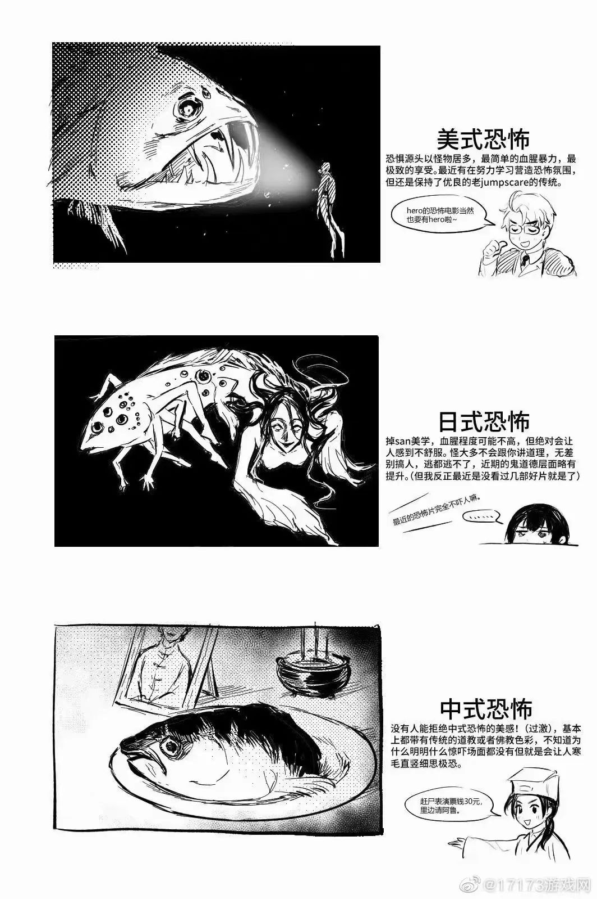

- {{embed ((62f79170-e765-4e5a-bb36-83b192746ce0))}}
## 今日阅读
	- [还是“中式恐怖”最恐怖_风闻](https://user.guancha.cn/main/content?id=838440)
		- “中式恐怖”的这几年在本质上是“翻红”，只是主要载体从小说、电影迁移到了游戏，概念的打造有外力因素，这意味着它依然有迅速降温的隐忧；另一方面，它又的确有潜力像赛博朋克、克苏鲁等成熟题材一样，在“总结式造概念”中，成为有着内在生命力的流行文化集合。
		- 2018年的游戏《灵魂筹码》以民国为背景，设计了土楼、戏院等地图，可操纵角色包括僵尸、鬼新娘等，不过游戏模式采用的是当时较火的“非对称对抗”。竞技游戏里的“恐怖”只能停留在视觉层面，《灵魂筹码》在宣传时也只用到“东方风格”、“中国风”等描述。
		- 半年后，某台湾制作组发售的一款恐怖游戏让许多玩家惊艳不已，但因为制作组的问题没有得到长期传播。2019年的《纸人》和《探灵：夜嫁》让这个品类开始出现流行势头，游戏质量在全球范围内都受到认可。
		- 2020年的《港诡实录》被多位电竞主播试玩，观众也乐于围观主播被惊吓的夸张反应，以至游戏主角“佳慧”被《英雄联盟》的粉丝们戏称为“杀穿了整个LPL的女人”，这让“中式恐怖”完成了一次基于直播平台和社交媒体的“出圈”。
		- 2021年则成了中式恐怖游戏的收获之年，两款《纸嫁衣》的TapTap评分分别达到9.2和9.6，《烟火》的Steam好评率高达98％，其流程通关视频在B站上最高能有400万以上播放量。
		- 
		- 有人曾提及，同样是“深夜里的衣柜”，一只有獠牙的恶鬼趴在柜顶，突然冲下来把你开膛剖肚，就是“美式恐怖”；柜子看起来没有异样，睡着后它会悄悄打开，房间传出尖叫，再过一会儿只剩凌乱被褥和地上血迹，这是“日式恐怖”；关灯后柜子怎么看怎么不对劲，甚至像有人立在那里，但一开灯就一切正常，就是“中式恐怖”。
		-
	- [鄱阳湖干旱 40 天缩水 69%，政府拟投资 435 亿建 2331 个水利项目，现当地情况如何？ - 知乎](https://www.zhihu.com/question/550276153)
## 动态心情
## 问题思考
## 流水记录