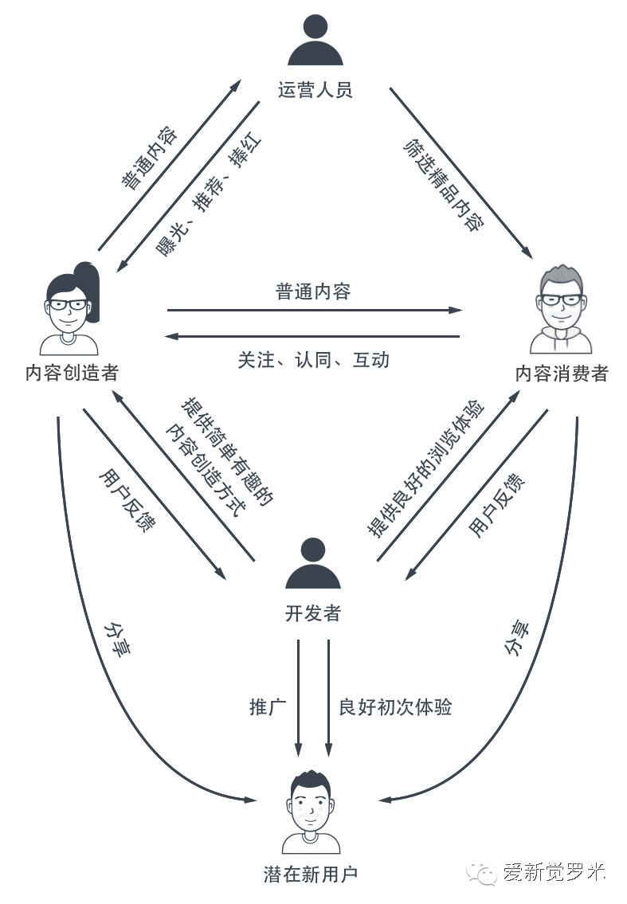

- {{embed ((62f79170-e765-4e5a-bb36-83b192746ce0))}}
## 今日阅读
	- 免费的网页检测服务 #工具
	  collapsed:: true
		- 天然:
		  Check酱，免费的网页检测服务，类似于RSS或IFTTT，可以每隔1小时，就检测指定网页的内容变动，并发送通知给自己的微信。
		- 用来监听微信文章更新、商品价格变动、最新小说更新、博主文章更新、自己的阅读量更新，以及其它各种你想监听的内容都可以，算是对各种通知的一个聚合。
		- 视频教程
		  collapsed:: true
			- {{bilibili https://www.bilibili.com/video/BV1JY4y1P71b}}
			- Check酱很早就支持了RSS，最新版配合 RSS Hub 浏览器插件，一键监测数百网站。
			- Check酱官方网站 ckc.ftqq.com
			- RSSHub 官方文档 docs.rsshub.app
			- 整合版插件下载 github.com/easychen/RSSHub-Radar-with-checkchan/releases
	- [电脑截图的4种场景以及对应的工具 - 知乎](https://zhuanlan.zhihu.com/p/559215040) #工具
	- [如何看待Stephen Wolfram声称万物理论已被发现? - 知乎](https://www.zhihu.com/question/387862824/answer/1157830985)
	  collapsed:: true
		- 全文一共一万六千多字，主要分为这几个部分：**从简单规则开始；所有可能的规则；空间的维度；时间；因果关系（因果不变论）；相对论；黑洞和奇点；量子力学；终极规则；一些感想。**
	- [如何从0到1搭建一个全新的社交产品](https://mp.weixin.qq.com/s/zeoTsDXQ8NOwDFLpQz_J7g) #产品
	  collapsed:: true
		- 
		- 社交产品比其他类型的产品做起来难度更高，主要原因在于，社交产品需要人的参与才能完成自我的搭建，而人在社区中的需求非常复杂、捉摸不定。**在社交产品中，最首要的就是服务好两大用户群体：内容创造者和内容消费者。**
		- 内容创造者即创造UGC的人群，社交产品需要优先满足好这类人群的需求，为其提供低门槛的、有趣的表达路径。内容消费者是以浏览内容为主的人群，他们的核心诉求是希望看到有趣的、值得消费的内容。在构思社交产品形态时，需要从创造者和消费者两端去思考，服务好这两类人群的需求，这样就可以让社区形成良性循环，形成自然增长。
	- [诸神之黄昏：2021年以后的互联网及新兴行业-虎嗅网](https://www.huxiu.com/article/419673.html) #互联网
	  collapsed:: true
		- 回顾历史：四次互联网红利及其后果
		- 2021年的互联网平台竞争版图
		- 互联网平台的本质：规则制定权 + 征税权
		- 三大不利因素的形成、发展与汇集
		- 平台的危机，以及产品/内容方的机遇
		- 尾声：诸神之黄昏
	- [让马化腾蹲守的这场直播，7位科学家把我们带向何处-虎嗅网](https://www.huxiu.com/article/392217.html) #前沿科学
	  collapsed:: true
		- 今年（2020年）WE大会邀请的科学家包括诺贝尔奖获得者Steven Weinberg、干细胞生物学家中内启光、脑机接口权威专家Miguel Nicolelis、量子物理学家潘建伟、化学家鲍哲南、天体物理学家Victoria Kaspi、天文学家Jane Greaves 。演讲内容从异种培育人体器官到金星生命，从粒子物理到脑机接口。
		- 量子物理学家潘建伟的演讲
		  collapsed:: true
			- 我们的古生物学告诉我们，在10万年之前我们存在着有两类人属。其中一类是尼安德特人，另外一类是智人。尼安德特人比智人更加强壮，甚至他的脑容量比现代人还大。智人，个体是弱于尼安德特人的。那么为什么智人会在进化当中胜出成为现代人的祖先呢？ 其中主要的原因是智人发明了基本的符号和语言。有了符号和语言的帮助之后，人们就可以进行有效的信息的交互，以至于可以形成一个互为一体的社会化的群体。所以，他在对抗大自然的各种困难当中变得更加地有效。
			- 其实在人类的进化当中还有一个事情是非常重要的，就是所谓的隐私的保护。==正因为大脑里面在想什么，在思考什么，是别人怎么样也没法知道的，所以它才能够导致思想的多样性。==而思想的多样性，是创新与进步的源泉。比如古希腊的雅典学院和我们春秋战国时候的百家争鸣，正因为这样才导致了各种各样的思想出来推动社会文明的进步。
			  id:: c53fff10-debc-420d-8bdc-1236497ed506
			- 量子通信的第一个应用就是所谓的量子秘钥分发。那比如说有张三和李四，他们为了进行安全的通信，可以先送一系列单光子，处于各种各样状态的单光子，由张三送给李四。那么如果中间有个窃听者存在，那我刚才讲到这光子的能量是不再可分的，不能分成半个，所以如果窃听者要把这个光子拿走的话，接收者李四就收不到了，所以这个秘钥你就没有收到。
	- 瑞·达利欧《原则：应对变化中的世界秩序》 #读书
	  collapsed:: true
		- {{bilibili https://www.bilibili.com/video/av851733803}}
		- [瑞·达利欧：为抵抗中国的技术威胁，美国正采取行动](https://baijiahao.baidu.com/s?id=1737740151329306931&wfr=spider&for=pc)
	- [虚拟现实革命前夕：第四次工业革命的钥匙之一——VR & AR深度行业研究报告 | 人人都是产品经理](https://www.woshipm.com/evaluating/4163541.html)
	- [当80%以上的工作是通过关系网络找到的，社恐人的未来在哪里？-今日头条](https://www.toutiao.com/article/6872918141870014990/)
		- “弱关系”之所以“弱”，既是因为求职人和关系人没有情感上的强联结，也是因为求职人往往不是专程联系关系人委托介绍工作。“弱关系”的发起大多是偶然的。却也因此，“弱关系”才能带来差异的、有用的劳动市场信息。由熟人组成的“强关系”反倒因为同质性高而不具备差异优势。
		- “强关系”往往就等同于“靠关系”“凭关系”。
		-
## 动态心情
## 问题思考
## 流水记录
- [[Comments]]
  collapsed:: true
	- [[2022年08月30日]]
	  collapsed:: true
		- ((c53fff10-debc-420d-8bdc-1236497ed506))
			- 互联网让获取知识变得更容易影响了人类的创造力吗？