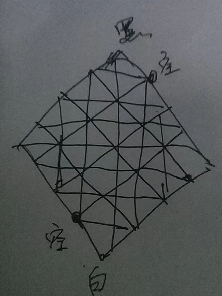
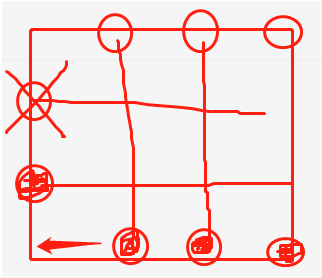

- {{embed ((62f79170-e765-4e5a-bb36-83b192746ce0))}}
## 今日阅读
	- 【巴西UFO听证会】（5/13）全程中文，超大规模目击事件 #视频 #UFO
		- {{bilibili https://www.bilibili.com/video/BV1GP4y1d7dk}}
	- 塞尔达有多好玩？ #视频 #游戏
	  collapsed:: true
		- {{bilibili https://www.bilibili.com/video/BV1qG4y1q7pw}}
	- 睡觉时为什么会失去意识【蒲慕明院士】 #视频 #科普
	  collapsed:: true
		- {{bilibili https://www.bilibili.com/video/BV15D4y1q7rw}}
## 事件动态
	- 本周话题：[[延续植物人的生命有意义吗？]]
		- 2022年09月14日，延续植物人生命的意义
		  collapsed:: true
			- 异恒（deciia）:
			  睡觉，昏迷，植物人，有什么区别
			- 风轩云冕:
			  有的能自己醒，有的不能
			- 异恒（deciia）:
			  植物人是否有可能经历这三状态，然后一觉醒来
			  植物人状态 代表 意识进入了虚拟世界，昏迷 代表植物人 睡觉了，睡觉代表是他们的清醒（实际上在我们看来他还是躺在床上）
			  而清醒意味着天塌了
			- 王肚白:
			  睡觉如果外界刺激过于猛烈还是能中断的
			- 骆驼祥子:
			  话说，大家知道明清梦吗
			- 熊猫许可🐼·N:
			  植物人从字面上解有植物两个字
			- 人变成了植物
			- 骆驼祥子:
			  人-肉体变成了植物
			- 人思维能不能感知外界？
			  如果能感知是24小时感知还是少时间感知？
			- 昏迷后的困在人身体的意识哪去了？
			- 异恒（deciia）:
			  从网上查到的资料来看，植物人状态没有意识活动，意识是从感知到建立记忆的中间的处理过程
			- [大脑需要怎样的神经网络结构来安放意识？](https://mp.weixin.qq.com/s/Rq4_our-PJLBVhC5cI0n7A)
	- 2022年09月14日讨论，围棋的落子规则，以及小时候玩过的棋
		- 王肚白:
		  围棋的落子规则是啥啊
		- 不存在-Re-dream:
		  气
		- 得气则生，失气则死
		- 王肚白:
		  好玄妙
		- 我光记住个金角银边的名字……
		- 4还不知道具体操作是啥
		- 不存在-华文sfhuawen:
		  金角银边草肚皮
		- 碳基处理器:
		  话说，你们不考虑一下，把棋子落成某个特定符文的时候触发法术效果的那种游戏吗？例如——北斗七杀阵：当你的七颗棋子落成北斗七杀符文时，提掉所有与其相连的对方棋子
		- 王肚白:
		  什么万宁围棋
		- [图片]
			- ### 有没有一种可能
			  是奈奈呀
			  小冰，女朋友生气不理人怎么哄。
			  小冰 作者
			  发搞笑视频啊肯定
			  是奈奈呀 回复 小冰
			  分手了，还被拉黑了
			  小冰 作者 回复 是亲奈呀 
			  啊别难过了我陪你
			- ### 就是说，他俩碰巧就是..
			  布丁奶瓶
			  听你的，跟他分手了
			  小冰 作者 
			  ?
			  布丁奶瓶 回复 小冰吵架
			  还发搞笑视频 
			  小冰 作者 回复 布丁奶瓶 
			  啊别生气了我陪你
			- ### 史上第一对被人工智能拆散的情侣
		- 异恒（deciia）:
		  哈哈
		- 浅暮:
		  没有规则，只有一条，四周无空则死
		- Chaotica:
		  有的
		- 四周无空也可以放，只要能吃棋
		- 碳基处理器:
		  打劫
		- Chaotica:
		  对
		- 打劫不能一直来回吃
		- 得下一步其他的
		- 浅暮:
		  我又没说四周无空不可
		- 下
		- 下了有空那就能活
		- 围棋的规则简单到，你只要摸两下棋就能懂
		- Chaotica:
		  雀食
		- 但是判断胜负其实挺费劲的
		- 尤其水平相当的时候
		- 浅暮:
		  还好吧
		- 下到无空可下
		- 数数目数就是
		- Chaotica:
		  ？
		- 浅暮:
		  我的意思是基本上没有什么下的价值的时候
		- Chaotica:
		  我怎么记得得把占的地方全数清了
		- 浅暮:
		  对啊
		- 就是数目数啊
		- Chaotica:
		  那种乱七八糟的棋局很难数的吧
		- 浅暮:
		  如果真的乱七八糟
		- 你可以用子先填进去
		- [动画表情]
		- Chaotica:
		  一般不都是把里面的子摘出去然后拼格子吗
		- 浅暮:
		  反正怎么方便怎么来
		- Chaotica:
		  对
		- 但是相比象棋跳棋军棋那种秒分胜负还是麻烦
		- 浅暮:
		  那确实
		- 毕竟人家规则复杂多了
		- 异恒（deciia）:
		  约定阵法和效果，有这样玩的吗
		- 浅暮:
		  这个很难设计的吧？
		- Chaotica:
		  有啊
		- Chaotica:
		  万宁围棋
		- Chaotica:
		  [视频]
			- {{bilibili https://www.bilibili.com/video/BV1xR4y1g7vR}}
		- 浅暮:
		  比如五子棋的五子就是精心设计的，我和同学试过四子六子，最后发现还是五子比较方便
		- Chaotica:
		  四子太容易了
		- 六子太难
		- 这东西复杂度应该是个指数
		- 五子正合适
		- 碳基处理器:
		  嗯
		- 浅暮:
		  如果落个7星的话
		- 就有一个符文
		- 那设计几个？
		- 怎么记各种变化
		- 是不是有方法应对
		- 感觉平衡性方面就会很难搞
		- 碳基处理器:
		  可以阻断
		- Chaotica:
		  所以万宁那个就是乱七八糟
		- 八仙过海
		- 只有娱乐性而没有竞赛性了
		- 碳基处理器:
		  对于传统棋牌的改造，最成功的是弑君者
		- 异恒（deciia）:
		  两军对阵，阵法杀敌，不局限于围棋四方格
		- 下棋的全盘落子，也可以改为根据通过阵营营帐指向性落子，从营帐指向的方向受限制的落子
		- 甚至可以让落子自己动起来，在动态的棋局中落子
		- 碳基处理器:
		  围棋都是超时空部署的
		- 异恒（deciia）:
		  可以叫阵棋，可以借鉴围棋的规则，不需要完全一样
		- 异恒（deciia）:
		  [视频]
			- {{bilibili https://www.bilibili.com/video/BV1GP4y1d7dk}}
		- 春天的风:
		  我小时候玩过一种棋，叫挑棋。很有意思，不像围棋那样难以精通。
		- 不存在-Re-dream:
		  玻璃球跳棋？
		- 春天的风:
		  不是，很像五子棋
		- 不存在-Re-dream:
		  黑白棋
		- 春天的风:
		  
		- 春天的风:
		  对角各摆十五个旗子，然后跳过一个子进攻。可以像五子棋一样两头夹子，也可以用时纵横夹子
		- 吃到对面动不了为胜。留空点那里可以走闲。
		- 夹子之后补上自己的子
		- 不过有一点缺陷，我还不知道怎么改进
		- 夹子棋
		- 异恒（deciia）:
		  [图片]
		- [图片]
			- 
		- 异恒（deciia）:
		  黑棋左移一格三子连珠可以杀死白棋
		- 不存在-Re-dream:
		  听说过类似玩法
		- 正道の幽灵:
		  [剪头发]
		- 王肚白:
		  以前还玩过一种一个人玩的棋,那个棋子都是圆的
		- 一个棋子跨过另一个球,然后将别跨过那个球取掉
		- 当时在我们小学同学家玩的规则给忘了,但对那个棋印象深刻,棋盘好像是大理石的,上面的棋子也是各种颜色的石头,有的还是透明的,不知带是水晶还是玻璃球
		- 我还记得我们那同学说好像叫咕嘟棋,好像是因为棋子在棋盘上滚动时发出的声音
		- 还是应该叫孤独棋？
		- 异恒（deciia）:
		  收集酒瓶盖，盖子里填满泥，两个人将各自的棋子在门槛或桌子上列阵摆好，用手指弹击棋子将对方的棋子撞下去，像台球一样
		- 技巧好的可以将棋子弹飞起来越过对方的阵打中后面的棋
		- 不存在-周笠枫:
		  我们这边是课桌弹钢镚
		- 王肚白:
		  炸王牌
		- 似乎依然在流行
## 问题思考
## 流水记录