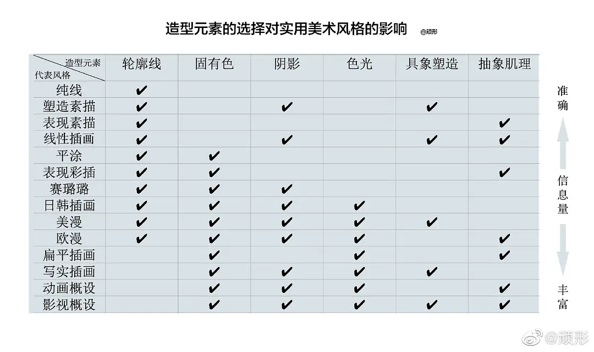

- 关于描述词
	- {{embed [[DreamStudio 提示指南]]}}
	- [关于Stable Diffusion的一点点心得 - 知乎](https://zhuanlan.zhihu.com/p/554262403)
	  collapsed:: true
		- 把你所有想要出现在画面里的元素都写出来，包括画面风格：油画的、莫比斯风格的、漫画风格的、金属的、黑白的等等，包括画面情感表达：恐怖的、悲伤的、阳光的等等，总之，都写上去，然后跑一组出来。需要特别注意的是，肖像描写最好加上“portrait of ”，这样有重点的描述，出来的结果也会更注重个体特征的塑造。
		- 然后根据出来的画面来决定要添加什么元素或者是减少什么元素，几轮下来通常是可以得到自己满意的画面的。
	- [disco diffusion有哪些画风关键词? - 知乎](https://www.zhihu.com/question/533924893/answer/2571977358)
	  collapsed:: true
		- 提示词由以下几部分组成
			- 画种描述：A beautiful painting of
			- 内容描述：a singular lighthouse, shining its light across a tumultuous sea of blood
			- 画家描述：by greg rutkowski and thomas kinkade
			- 参考渲染方式：Trending on artstation（全球最专业的CG艺术家社区，又称A站）
			- 颜色描述：yellow color scheme
			- 比如：victoria's mansion under sunrise sky,beautiful landscape,comicstyle,by Hilma af Klint.
	- [描述语该怎么写？超详细讲解，disco diffusion进阶教程之prompts技巧思路_哔哩哔哩_bilibili](https://www.bilibili.com/video/BV1rW4y1z7oG/)
		- W：你要画什么，H：你要怎么画
		  collapsed:: true
			- "Abeautiful painting of a singular lighthouseshining its light across a tumultuous sea of blood by greg rutkowski and thomas kinkade,Trending on artstation.""yellow color scheme"
			- "一幅美丽的画作，描绘了一座奇异的灯塔，它的光线穿过汹涌的血海，格雷格·鲁特考斯基和托马斯·金卡德绘制的趋向于Artstation(A站)。"“黄色配色方案’
			- 描述语没有任何规则，但是成功（精准）的描述宜包含以下内容：
				- 图片风格，可以有一些明显的风格
					- 哥特风，洛可可，漫画风，像素画，浮世绘，山水画
				- 图片类型，一般在前面奠定基调
					- 一张什么类型的图片，照片？油画？抽象画？产品模型？
				- 环境细节，描述画面里包含的东西
					- 什么样的环境，有什么，什么样的结构，关系有什么（慎用动词）
		- 画面类型（前缀）
			- 好用推荐:
				- A beautiful painting 
				  一幅美丽的油画(插画)
				- A beautiful detailed watercolor painting 
				  一张水彩画
				- A ink drawing 
				  一幅水墨画
				- A cinematic hyperrealism highly detailed photograph
				  一张超现实主义电影感的照片
				- A ultra-realistic CG rendering
				  一张CG级的逼真渲染
				- A digital painting
				  一张数码照片
				- A ukiyo-e print
				   一张浮世绘
		- 细化元素
			- 什么场景
			  collapsed:: true
				- 紫禁城、哥特风、未来城市、亭台楼阁、空间站
				- Cyberpunk City/赛博朋克城市
				- Steam City/蒸汽城市
				- Industrial Cities/工业城市
				- Country Cottage/乡村小屋
				- Gothic/哥特
				- Bell Tower/钟塔
				- Temple/寺庙
				- pavilions/亭台楼阁
				- Space Station/空间站
				- Port/港口
				- Majestic Palace/雄伟宫殿
				- Landscapes/风景
				- Terraced field on the hill/梯田
				- rice fields/稻田
				- waaterlily pond/睡莲池
				- lotus pond/荷花池
			- 有哪些元素
			  collapsed:: true
				- 尽量通俗简洁、大众化表达
				- 山、河、月、花、阳光
			- 结构关系
			  collapsed:: true
				- 在什么里面： in
				- 在什么上面：above
				- 有什么：there are / with
			- 什么颜色
			  collapsed:: true
				- 单色：yellow color
				- 两种颜色：black and white
				- 颜色：colorful
			- 艺术家风格：能找到出处的艺术家
			  collapsed:: true
				- A 站：artstation
				- 知名画家：Monet Van GOgh
		- 描述语控制画面
			- 视角描述
				- 广角、微距、俯瞰、仰视
			- 画面清晰程度
				- 精致细节，4K高清
			- 画面光影效果
				- 光照效果，体积照明
			- 画面结构
				- 默认越靠前的词语权重越大
			- 描述语的权重
				- 人物，水印，文字
			- 渲染风格
			  collapsed:: true
				- Flickr
				- ArtStation HD
				- Behance HD
				- HDR
				- Anime
				- Filmic
				- Stock photo
				- Ambient Occlusion
				- Global illumination
				- Chalk art
				- Low poly
				- Booru
				- 8k resolution
				- pencil sketch
				- 8K 3D
				- Creative commons attribution
				- Deviantart
				- CryEngine
				- Unreal Engine
				- concept art
				- photoillustration
				- pixiv
				- Watercolor
				- CGSociety
				- child's drawing
				- marble sculpture
				- airbrush art
				- renaissance painting
				- Velvia
				- Provia
				- photo taken with Provia
				- prerendered graphics
				- criterion collection
				- dye-transfer
				- stipple
				- Parallax
				- Bryce 3D
				- Terragen
				- (2013) directed by cinematography by
				- Bokeh
				- 1990s, 1995
				- 1970s, 1975
				- 1920s, 1925
				- charcoal drawing
				- Depth of field
				- DSLR
				- Detailed painting
				- Volumetric lighting
				- Storybook illustration
				- Unsplash contest winner
				- vfxfriday
				- Ultrafirne detail
				- 20 megapixels
				- Photo taken with Fugiflm Superia
				- Photo taken with Ektachrome
				- matte painting
				- reimagined by industrial light and magic
				- Polycount
				- Acrylic art
				- Hyperrealism
				- Zbrush Central
				- Rendered in cinema4D
				- Rendered in Maya
				- Photo taken with Nikon D750
				- Tilt shift
				- Mixed media
				- made of beads and yarn
				- made of feathers
				- made of crystals
				- made of liquid metal
				- made of glass
				- made of cardboard
				- made of vines
				- made of cheese
				- made of flowers
				- made of insects
				- made of mist
				- myportfolio
				- Bokeh
				- digital illustration
				- stock photo
				- aftereffects
				- speedpainting
				- colorized
				- detailed
				- psychedelic
				- wavy
				- groovy
				- movie poster
				- pop art
				- commission for
				- furaffnity
				- flat shading
				- ink drawing
				- artwork
				- oil on canvas
				- macro photography
				- hall of mirrors
				- hall of mirrors
				- polished
				- sunrays shine upon it
				- aftereffects
				- iridescent
				- film
				- Datamosh
				- (1962) directed by cinematography by
				- Holographic
				- dutch golden age
				- digitally enhanced
				- National Geographic photo
				- Associated Press photo
				- Matte background
				- Art on Instagram
				- ISO 200
				- Bob Ross
				- 32k HUHD
				- Photocopy
				- DeviantArt HD
				- TriX 400 TX
				- Surrealist
				- THX Sound
				- ZBrush
				- Panorama
				- Smooth
				- DC Comics
				- Marvel Comics
				- Ukiyo-e
				- Flemish Baroque
				- vray tracing
				- pixel perfect
				- quantum wavetracing
				- Zbrush central contest winner
				- Masterpiece
				- Fauvism
				- shot on 70mm
				- Art Deco
				- Picasso
				- Da Vinci
				- Academic art
				- 3840x2160
				- Photocollage
				- Cubism
				- American propaganda
				- Soviet propaganda
				- PS1 graphics
				- Fine art
				- HD mod
				- Photorealistic
				- Poster art
				- Constructivism
				- pre Raphaelite
				- Impressionism
				- Lowbrow
				- RTX on
				- Chiaroscuro
				- Egyptian art
				- 2D game art
				- Windows XP
				- y2k aesthetic
				- screenshotsaturday
				- Seapunk
				- Vaporwave
				- llya Kuvshinov
				- Paul Cezanne
				- Henry Moore
				- Phallic
				- Creepy pasta
				- Geometric
				- Cluttered
				- ROCOCO
				- SSAO
				- Destructive
				- by James Gurney
				- by Thomas Kinkade
				- by Vincent Di Fate
				- by Jim Burns
				- androgynous
				- masculine
				- genderless
				- feminine
				- extremely gendered, masculine and feminine
				- 4k result
				- Matte drawing
				- Matte photo
				- Glowing neon
				- Xbox 360 graphics
				- Flickering light
				- Playstation 5 screenshot
				- Kodak Gold 200
				- By Edward Hopper
				- Rough
				- Maximalist
				- Minimalist
				- Kodak Ektar
				- Kodak portra
				- made of paperclips
				- made of rubber
				- made of plastic
				- made of wire
				- made of trash
				- made of wrought iron
				- made of all of the above
				- battoo
				- woodcut
				- trending on artststion
				- featured on artstation
				- artstartion HQ
				- trending artstation
				- ultra HD
				- high quality photo
				- instax
				- ilford hp5
				- infrared
				- Lomo
		- 注意
		  collapsed:: true
			- 慎重使用人物相关的词语
			- 慎用动词，尽量用状态词或形容词代替
			- 慎用彩色，可能会导致画面花哨丧失美感
			- 选择对的艺术家，可能事半功倍，未选对艺术家，可能会出现车祸现场
			- 描述语不可过长
		- 更多参考
		  collapsed:: true
			- [AI绘画的关键词（群友们的画 ）](https://397987634.notion.site/397987634/AI-764e6a50fbf04327945a12a07ce9654f)
			- [AI绘画，提示语经验分享 - 哔哩哔哩](https://www.bilibili.com/read/cv15746899)
- 描述词关键词参数
	- 参数格式
	  collapsed:: true
		- 风格
			- 艺术家
				- 内容性质
					- 渲染方式
						- 颜色
	- 内容描述
	- 画种、风格
		- ### 视觉风格
			- 造形元素
				- 轮廓线、固有色、阴影、色光、具象塑造、抽象肌理，参考[14种绘画风格分类](https://www.douban.com/group/topic/234875985/?author=1&_i=1574938gXsaYzD)
			- 线条艺术
				- Pencil drawing / Pen drawing 铅笔画，钢笔画
					- 艺术家
						- Albrecht Dürer
						- Leonardo da Vinci
						- Michelangelo
						- Jean-Auguste-Dominique Ingres
					- 素描
						- 塑造素描
						- 表现素描
						- 线性插画
				- 描线
				- 几何图形
				- 涂鸦风
				- 图形线条
				- 突异比例
			- 色彩
				- 平涂
				- 表现彩插
			- 质感
				- 噪点
				- 颗粒质感
				- 肌理质感
					- 抽象股理
				- Oil painting 油画
				  collapsed:: true
					- 艺术家
						- Leonardo DaVinci
						- Vincent Van Gogh
						- Johannes Vermeer
						- Rembrandt
				- 水彩
			- 维度
				- 3D
				- 5D艺术和动画
				  id:: 6309d99b-1dc8-4ac3-830a-03d92f391fc5
				- C4D立体插画
				- 2.5D 纪念碑谷
					- 商业项目插画
					- 2.5D等距视角风格
			- 图形
				- 肖像画
					- 艺术家
						- John Singer Sargent
						- Edgar Degas
						- Paul Cézanne
						- Jan van Eyck
				- 风景艺术 Landscape art
				  collapsed:: true
					- 艺术家
						- Thomas Moran
						- Claude Monet
						- Alfred Bierstadt
						- Frederic Edwin Church
				- 细密精致
				- 扁平化
					- 扁平描边
				- 极简
				- 哥特建筑
				- 少女
				- Q版卡通
			- 文化流派
			  collapsed:: true
				- 欧美流派
					- 现实主义，Realistic  写实
						- 杜米、埃库尔
					- 印象派
					  collapsed:: true
						- 马奈、雷诺阿
					- 野兽派
					- 新艺术
					- 表现主义
					- 立体派，主体主义
					  collapsed:: true
						- 毕加索、波拉克
					- 现代派
					- 未来主义
					- 抽象派
					- 达达主义
					- 至上主义
					- 形而上主义
					- 超现实主义
					  collapsed:: true
						- 奇幻、科幻
						- 赛博朋克
						- 克苏鲁 Cthulhu
					- 行动画派
					- 极简艺术
					- 波普艺术
					- 佛罗伦萨画派
					  collapsed:: true
						- 达芬奇、米开朗基、罗拉斐尔
					- 浪漫主义
					  collapsed:: true
						- 借里柯、戈雅德拉、克洛瓦
					- 抽象派
					  collapsed:: true
						- 康定斯基、蒙特里安
					- 复古，古典主义
					- 新古典主义
					- 后印象派
				- 中国画流派
					- 花鸟画
					  collapsed:: true
						- 黄筌画派
							- 五代西蜀黄筌
								- 善于取熔前人轻勾浓色的技法，独标高格
							- 宋初的黄居寀
						- 徐家野逸
							- 五代南唐的徐熙
								- 注重墨骨勾勒，淡施色彩，流露潇洒的风格
							- 张仲、王若水，到明代沈周、陈道复、文征明、徐渭
					- 竹
					  collapsed:: true
						- 湖州竹派
							- 宋文同
							- 苏轼
					- 花卉、草虫写生
					  collapsed:: true
						- 常州画派，毗陵画派，武进画派
							- 北宋毗陵僧人居宁
								- 草虫似属禅林墨戏一路
							- 南宋元初于青言、于务道祖孙
								- 以画荷著称
							- 明代孙龙擅
								- 画泼彩写意花鸟
							- 清代唐于光
								- 以“唐荷花”和恽寿平的“恽牡丹”为著名
					- 自然风景
					  collapsed:: true
						- 米派
							- 宋代米芾、米友仁父子
								- 米芾画山水从董源变来，突破勾廓加皴的传统技法，多用水墨点染，不求工细，其子米友仁，字元晖，晚年号懒拙老人，画院学士，其山水画发展了米芾技法，用水墨横点写烟峦云树，崇尚平淡天真，运笔潦草，自称“墨戏”。
								- “二米”山水画多以云山、雨霁、烟雾为题材，纯以水墨烘托，用卧笔横点成块面的“落茄法”表现烟雨云雾、迷茫奇幻的妙趣，世称“米点山水”、“米氏云山”。
							- 南宋牧溪、元代高克恭、方从义
						- 岭南画派
							- 明清林良
								- 擅画花果、翎毛，着色简淡，备见精巧，常以水墨为烟波出没，凫雁嚵唼容之态，清淡有致。其水墨禽鸟、树石笔法放纵简括，遒劲飞动，有类草书，墨色灵活。
						- 海上画派
							- 近代清末赵之谦、任颐（任伯年？）、虚谷、吴昌硕、黄宾虹等
								- 继承传统绘画技法与风格的基础上，破格创新，既融合民族艺术之精华，又善于借鉴吸收外来的艺术，尽可能达到雅俗共赏
						- 现代中国画流派
							- 徐悲鸿、刘海粟、蒋兆和、杨玉琪
						- 巴蜀画派
							- 张大千
						- 中国抽象派
							- 赵春翔、吴冠中、应诗流、李磊、韩煜、樱馨、吴震寰等
				- 二次元 comic，动画Anime，漫画Manga
			- 情感氛围
			  collapsed:: true
				- 暗黑/奇异/神秘
				- 诙谐幽默
					- 玩味夸张人物风格
				- 自然风
		- ### 商业插画角度
			- 插画、漫画
			- Concept art 概念艺术
			  collapsed:: true
				- 原画
					- 游戏原画
				- 场景设计、建筑设计
				- 动画概念设计，动画概设
				- 影视概设
			- 海报
			- 时尚插画
			- 儿童插画
			- 公共空间项目，墙画，涂鸦
			- 医学，科技插画
			- 形象IP
			- 编辑插画
			  collapsed:: true
				- 书籍插画、文章插画
			- 互联网插画
			  collapsed:: true
				- 矢量图
			- 广告与包装插画
			  collapsed:: true
				- 企业宣传插画
				- 政治插画
				- 商品插画
				- 个人品牌
				- 电影宣传
				- 唱片封面
				- 书籍封面
		- ### 绘制手法和国家
			- 绘制手法
				- 水墨画、油画、版画、水粉画、壁画、漫画、工笔画、写意画、抽象画、青绿山水画、水墨山水画、白描画、指画、界画、内画、素描
				- 手绘
				- 数码板绘
				- 传统纸绘
				- 木版画
				- 金属蚀刻画
				- 拼贴画
				- 纸艺艺术
				  collapsed:: true
					- 剪纸
					- 立体书
				- 写实摄影、照片
				- 字体设计
				- 书法
			- 国家
				- 中国年画、中国画、国潮
				- 水墨风
				- 日韩风
				  collapsed:: true
					- 浮世绘
					- 日式赛璐璐
				- 欧美
				  collapsed:: true
					- 美漫
					- 欧漫
		- 风格迁移（艺术家风格迁移到不同画种）
		- 复杂画面
		- 参考资料
			- [【插画】NO.3 插画风格 | 史上最全整理 |多图预警 - 知乎](https://zhuanlan.zhihu.com/p/365802870)
			- [插画 (illustration) 是否也分风格流派？ - 知乎](https://www.zhihu.com/question/23362525/answer/1922755809)
			- [Disco Diffusion Modifiers | Weird Wonderful AI Art](https://weirdwonderfulai.art/resources/disco-diffusion-modifiers/#top)
			- [Disco Diffusion 70+ Artist Studies | Weird Wonderful AI Art](https://weirdwonderfulai.art/resources/disco-diffusion-70-plus-artist-studies/)
	- 艺术家
		- 作品形式，比如Fate
		- 游戏概念插画，美国插画师David Le Merrer，游戏《Super Lucky's Tale》
		- 概念插画，保加利亚插画师Hristo Chukov，动画项目《Mouse Guard》
		- 广告包装插画，俄罗斯插画师Vera Zvereva
		- 设计的包装插画，白俄罗斯插画师Anastazi Li，环保涂料品牌Color Care
	- 渲染方式
		- {{embed ((6308a38f-8ee5-4841-86d6-6742b96524cb))}}
		- 图片作品发布平台
			- 《The New Yorker》封面插画
		- 渲染平台
		- 渲染软件
			- C4D
	- 颜色
		- 霓虹
	- 关键词顺序
	- 关键词表达方式
- 艺术家风格参考
  collapsed:: true
	- [Disco Diffusion:prompt描述语作者参考·Hilma af Klint](https://zhuanlan.zhihu.com/p/540590813)
	- [AI绘画 stable diffusion二次元美少女测试](https://www.xiaohongshu.com/discovery/item/62f8966200000000120097e3)
	  collapsed:: true
		- 应大家要求测试一下stable的二次元美少女，全用了日本的画家，包括
		- 小岛文美Ayami Kojima/山本高远takato yamamoto 用于华丽的浮世绘风格
		- 副岛成记shigenori soejima/皆叶英夫minaba hideo/小畑健takeshi obata 用于人物造型
		- 寺田克也katsuya terada 用于表现结构线
		- 空山基Hajime Sorayama 用于塑造盔甲
		- 关于二次元风格的要点：
			- 1.二次元有两种风格 :动画Anime/漫画Manga ，动画人物细节较少，动作比较僵硬但表情丰富。漫画细节动态多，背景丰富但没有表情。
			- 2.关键词权重是按顺序排列的，二次元风格很吃画风，要比其他风格更加注意权重。
			- 3.1-3号图是按照正常的书写习惯，描述+画家 +效果。结果画家没有权重，画面只体现了非常普通的美少女风格。用的画家是皆叶英夫/小畑健
			- 4.从四号开始把画家放在首位。粉丝推荐用米山舞，但谷歌查她的英文名只有不到10张作品且AI无法识别，因此我用了她曾经参与过的动漫Fate，放在句式的第一位，变成：详细描述fate的漫画海报 关于一个什么少女，什么衣服等等。画风就秒变专业。
			- 5.第五张，也是Fate开头，把漫画改成动画，人物立体了，但动态没有那么丰富。
			- 6.第六张前置了副岛成记，人物就变成他画的那种细长条身材。
			- 7第七张前置了小岛文美，变成华丽成熟画风。
			- 8.第八张前置了小岛文美+新艺术风格，变成华丽卡牌造型。
			- 9.第九张前置了山本高远，变成复古的风格。
			- 10.寺田克也/空山基 夹杂在中间人物描述里面，能丰富细节。
			- 11.想要好看的造型最好在末尾加上artgerm和穆夏。这两个人相当于二次元钥匙。
			- 12.千万不要加的词是pixiv，会变成小学生画风。
			- 13.AI对日本画家收录很少，所以用整部动漫的名字比画家名字更容易出效果，但要连载时间很长的动漫才可以，例如连载12年的进击的巨人可以识别，而鬼灭之刃只有4年就无法识别。而Fate是一个历时18年包含很多动画，漫画，游戏，小说的综合体，因此风格非常的突出。
			- 14.手部依然不够准确，动作不够丰富，元素多的图片像素不高。
	- [【画风分类】14种绘画风格分类。](https://www.douban.com/group/topic/234875985/?author=1&_i=1574938gXsaYzD)
	  collapsed:: true
		- 
		- 轮廓线：勾勒物体形状的线
		- 固有色：物体原本的颜色（默认是白光下物体呈现的色彩）
		- 阴影：光照射物体后，没有被光照到的部分所呈现不同程度的黑暗区域
		- 色光： 带有冷暖色彩倾向的光照射在物体上后，会改变其原本呈现的颜色（例：青苹果被夕阳的橙红光照射会偏向紫色）
		- 具象塑造：物体的细节，即体现现实物体的详细结构和质感的描绘手法
		- 抽象肌理：随机纹路，靠绘画材料的特性、笔刷效果等等这种抽象元素制造
		- [具象塑造]与[抽象肌理]两者都是为了增加画面的信息量（精细度）。它们之间可以分开也可以巧妙结合。
	- [一分钟看懂15种绘画流派，中国都有代表作品](https://www.sohu.com/a/237494758_100130990)
- 描述测试一
  collapsed:: true
	- a beautiful mannequin made of marble printed in 3d geometric neon +kintsugill, facing a giant doorway opening with a neon pink light flowering iridescent pineapples + orchids, transcendent, vibrant color, clean linework, finely detailed, 4k, trending on artstation, photorealistic, volumetric lighting octane render
	  collapsed:: true
		- 一个由大理石制成的漂亮人体模型，用 3D 几何霓虹灯 +kintsugill 打印，面对一个巨大的门口开口，上面有霓虹粉色的光开花的彩虹色菠萝 + 兰花，超凡的，鲜艳的色彩，干净的线条，精细的细节，4k，artstation 上的趋势，真实感，体积 灯光辛烷值渲染
		- 
		- 随机满意的效果后可以指定seed
	- 鼻梁上有蝴蝶黑痣的女孩，笑得很甜蜜，美丽的肖像，漫画风格，小岛文美所作
	  collapsed:: true
		- The girl with the butterfly mole on the bridge of the nose, smiling sweetly, beautiful portrait, manga style, by Fumami Kojima
			- 
	- 鼻梁上有蝴蝶黑痣的女孩，笑得很甜蜜，穿着中国传统服饰，背景有落叶、青松，还有叶子在风里卷着，美丽的肖像，漫画风格，副岛成记和小畑健所作
	  collapsed:: true
		- Girl with a butterfly mole on the bridge of her nose, smiling sweetly, in traditional Chinese dress, with fallen leaves, green pines in the background, and leaves curled in the wind, beautiful portrait, comicstyle, by shigenori soejima and takeshi obata, Trending on artstation, artgerm and Mucha
		- 
		- Girl with a butterfly mole on the bridge of her nose, smiling sweetly, in traditional Chinese dress, with fallen leaves, green pines in the background, and leaves curled in the wind, beautiful portrait, comicstyle, by takeshi obata and takato yamamoto, Trending on artstation
	- 女孩在考题的海洋中泛舟荡桨，她像浪花中的海燕，胜利的微笑，美丽的肖像，中国传统服饰，漫画风格，minaba hideo 和Ayami Kojima 所作
	- 海洋中泛舟的女孩，美丽的肖像，中国服饰，漫画风格，Ayami Kojima 和 takeshi obata 所作
	- 女孩在舟上，大海中的涡漩，海燕，美丽的肖像，漫画风格，shigenori soejima 所作
	  collapsed:: true
		- Girl on a boat, whirlpool in the sea, petrel, beautiful portrait, manga style, by shigenori soejima
		- 
		- Smiling girl on a boat, whirlpool in the sea, petrel, beautiful portrait, manga style, by minaba hideo, Trending on artstation, artgerm and Mucha
		- 
		- Girl on a boat, whirlpool in the sea, petrel, beautiful portrait, manga style, by minaba hideo, Trending on artstation, artgerm and Mucha
- 描述测试二
	- 用disco diffusion 的描述词格式尝试一下
		- A ink drawing of the bright study, 7 cards on the desk, by Zhu Da, ambient lighting, epic composition,4k
	- Watercolors of Warm Family, Portraits of Women, Watching TV Together, 2.5d, by Michelangelo and John Singer Sargent, Highly detailed, trending on art station, the most beautiful image ever seen, ambient lighting, epic composition, 8k