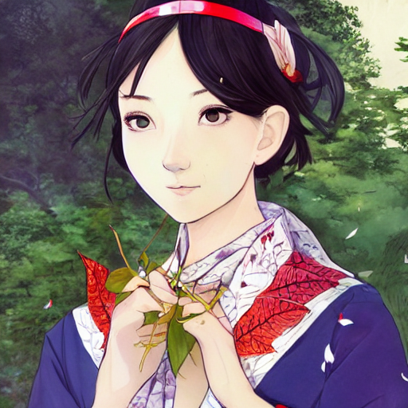

- 描述测试一
  id:: bee07164-c380-446a-8504-656252aa63d0
  collapsed:: true
	- a beautiful mannequin made of marble printed in 3d geometric neon +kintsugill, facing a giant doorway opening with a neon pink light flowering iridescent pineapples + orchids, transcendent, vibrant color, clean linework, finely detailed, 4k, trending on artstation, photorealistic, volumetric lighting octane render
	  collapsed:: true
		- 一个由大理石制成的漂亮人体模型，用 3D 几何霓虹灯 +kintsugill 打印，面对一个巨大的门口开口，上面有霓虹粉色的光开花的彩虹色菠萝 + 兰花，超凡的，鲜艳的色彩，干净的线条，精细的细节，4k，artstation 上的趋势，真实感，体积 灯光辛烷值渲染
		- 
		- 随机满意的效果后可以指定seed
	- 鼻梁上有蝴蝶黑痣的女孩，笑得很甜蜜，美丽的肖像，漫画风格，小岛文美所作
	  collapsed:: true
		- The girl with the butterfly mole on the bridge of the nose, smiling sweetly, beautiful portrait, manga style, by Fumami Kojima
			- 
	- 鼻梁上有蝴蝶黑痣的女孩，笑得很甜蜜，穿着中国传统服饰，背景有落叶、青松，还有叶子在风里卷着，美丽的肖像，漫画风格，副岛成记和小畑健所作
	  collapsed:: true
		- Girl with a butterfly mole on the bridge of her nose, smiling sweetly, in traditional Chinese dress, with fallen leaves, green pines in the background, and leaves curled in the wind, beautiful portrait, comicstyle, by shigenori soejima and takeshi obata, Trending on artstation, artgerm and Mucha
		- 
		- Girl with a butterfly mole on the bridge of her nose, smiling sweetly, in traditional Chinese dress, with fallen leaves, green pines in the background, and leaves curled in the wind, beautiful portrait, comicstyle, by takeshi obata and takato yamamoto, Trending on artstation
	- 女孩在考题的海洋中泛舟荡桨，她像浪花中的海燕，胜利的微笑，美丽的肖像，中国传统服饰，漫画风格，minaba hideo 和Ayami Kojima 所作
	- 海洋中泛舟的女孩，美丽的肖像，中国服饰，漫画风格，Ayami Kojima 和 takeshi obata 所作
	- 女孩在舟上，大海中的涡漩，海燕，美丽的肖像，漫画风格，shigenori soejima 所作
	  collapsed:: true
		- Girl on a boat, whirlpool in the sea, petrel, beautiful portrait, manga style, by shigenori soejima
		- 
		- Smiling girl on a boat, whirlpool in the sea, petrel, beautiful portrait, manga style, by minaba hideo, Trending on artstation, artgerm and Mucha
		- 
		- Girl on a boat, whirlpool in the sea, petrel, beautiful portrait, manga style, by minaba hideo, Trending on artstation, artgerm and Mucha
- 描述测试二
  id:: 630b0451-e6c2-413c-a52b-4aa12eb17707
  collapsed:: true
	- a magical witch, radiating rebirth energy, art by caspar david friedrich, power auras, sigils, tattered cloth robes, substance 3d painter, pbr textures, physical based rendering, cinematic, hyper realism, high detail, octane render, unreal engine, 8k, vibrant colors, smooth gradients .
	- Asia girl, glossy eyes, face, long hair, fantasy, elegant, highly detailed, digital painting, artstation, concept art, smooth, illustration, renaissance, flowy, melting, round moons, rich clouds, very detailed, volumetric light, mist, fine art, textured oil over canvas, epic fantasy art, very colorful, ornate intricate scales, fractal gems, 8 k, hyper realistic, high contrast
	  collapsed:: true
		- 亚洲女孩，有光泽的眼睛，脸，长发，幻想，优雅，高度详细，数字绘画，艺术站，概念艺术，平滑，插图，文艺复兴，流动，融化，圆月，丰富的云，非常详细，体积光，雾，美术，画布上的纹理油，史诗般的幻想艺术，非常丰富，华丽和复杂的比例，分形宝石，8 k，超现实，高对比度
	- little boy sitting at the talking desk and doing homework，glass window,fantasy, intricate, volumetric environment, moon rim light, illustration, highly detailed, digital painting, concept art, matte, art by Caspar David Friedrich and Artgerm and Greg Rutkowski and Alphonse mucha, masterpiece, 8k.
	  collapsed:: true
		- 小男孩坐在会说话的书桌旁做作业，玻璃窗，幻想，复杂的体积环境，月边灯，插图，高度细节，数字绘画，概念艺术，哑光，卡斯帕·戴维·弗里德里希和阿特杰姆和格雷格·鲁特科夫斯基和阿尔方斯·穆查的艺术，杰作，8k。
		- 
		- 加上中国画关键词，去掉数字画
		  collapsed:: true
			- Chinese traditional painting, little boy sitting at the talking desk and doing homework，glass window,fantasy, intricate, volumetric environment, moon rim light,  illustration, highly detailed, concept art, matte, art by Caspar David Friedrich and Artgerm and Greg Rutkowski and Alphonse mucha, masterpiece, 8k.
			- 
		- 爱情那把伞5、6配图
		  collapsed:: true
			- 大男孩睡在床上
			  collapsed:: true
				- Big boy  sleeping in the bed
			- 男孩站在天桥上，夜光透过树的缝隙
			  collapsed:: true
				- The big boy stood on the overpass, the night moonlight through the cracks in the trees
			- 大男孩躺在天桥上，天桥上有一只青蛙，月光透过树的缝隙，很多纸片和海鸥飞在海浪上面，月亮女神在天上装扮梳洗，星星在云的后面
			  collapsed:: true
				- The big boy was lying on the overpass. There was a frog on the overpass. The moonlight passed through the gaps in the trees. Many pieces of paper and gulls flew on the waves. The moon goddess dressed up and washed in the sky. The stars were behind the clouds
			- 大男孩趴在天桥的椅子上，旁边有一只青蛙，月光透过树的缝隙，云，星星
			  collapsed:: true
				- The big boy was lying on the chair of the overpass. There was a frog beside him. The moonlight passed through the gaps in the trees, clouds and stars
				- The big boy was lying on the stool on the overpass. There was a frog beside him. The moonlight was shining through the gaps in the trees
			- 月神女神跳芭蕾舞，树精，老鼠，大地上有光
			- 美丽的女孩，抱着双膝，对着月亮微笑
			  collapsed:: true
				- Beautiful girl holding her knees smiling at the moon
			- 屋檐垂落雨帘，溪水，风车，夏天
			  collapsed:: true
				- Rain curtain falling from eaves, stream, windmill, summer
			- 男孩拉着女孩的手站在阳台上，开心的女孩眼睛明亮
			  collapsed:: true
				- The boy and the girl stood on the balcony. The happy girl had bright eyes
		- 大山和它的子民配图
		  collapsed:: true
			- 光秃秃的，像斗鸡的冠一样，高耸入云的山，暴雨
				- The mountains towering into the clouds are bare, like the crowns of cockfighting. It rains heavily, fantasy, intricate, volumetric environment,  illustration, highly detailed, chinese digital painting, concept art, matte, art by Caspar David Friedrich and Artgerm and Greg Rutkowski and Alphonse mucha, masterpiece, 8k.
			- 蜿蜒的山脉，像蛇一样睡卧的山脉 ,碧绿
				- Winding and sleeping like snake mountains, green
				- 起伏不断，林海茫茫的绿色的丘陵，点缀小黄花
					- Ups and downs, the vast green hills of the forest, dotted with small yellow flowers
			- 男人在山上用斧子砍树，绿色，林海
			- 春天，满山的杜鹃花，红色的山，挺拔的杉树，弯曲的路，夕阳
				- Spring, azaleas all over the mountain, tall and straight fir trees, curved roads, sunset
			- 下雨天，小溪，果树，枇杷熟了
			- 山路十八弯，许多人在爬山，日出
				- Many people are climbing the mountain, eighteen bends of the mountain road, sunrise
- 描述测试：山水画
  id:: 630ac5d3-be92-4b52-b6c5-13642ef2a2d6
  collapsed:: true
	- chinese landscape by 倪传婧
	- chinese water ink style landscape painting, fishing boat in the river, singing girl
	- 中国国画风格，风景，人物，江中渔船，歌女，琵琶，傅抱石 和 阎立本所作
	  collapsed:: true
		- Chinese traditional painting,  fishing boats in the river, singing girls, pipa, by Fu Baoshi and Yan Liben
		- chinese water ink style landscape, The Pi-pa Player, fishing boat in the river, singing girl, by Fu Baoshi
		- Chinese traditional painting, beautiful woman, by Tang Yin and Ayami Kojima and takeshi obata
		- Chinese traditional painting,  beautiful woman, by katsuya terada and takeshi obata, epic composition, Highly detailed
	- 中国画，山水画，云、雾及春，art by 刘国松
		- Chinese painting, landscape painting, cloud, fog and spring, art by Liu Guosong
- 来自 [Lexica – chinese](https://lexica.art/?q=chinese) 可用的描述词一
  id:: 630d7e22-392c-4810-b3c3-eeb6bf4e2d20
  collapsed:: true
	- A portrait of a chinese - african princess, moon light, finely detailed features, perfect art, at an ancient city, gapmoe yandere grimdark, trending on pixiv fanbox, painted by greg rutkowski makoto shinkai takashi takeuchi studio ghibli, akihiko yoshida
		- 吉卜力工作室吉卜力的greg rutkowski makoto shinkai takashi takeuchi绘制的一幅中国-非洲公主的肖像，月光，精细的特征，完美的艺术，在一座古城，gapmoe yandere grimdark，在pixiv风扇箱上呈现趋势
		- A film still of a busy chinese empire, sun lighting, finely detailed features, perfect art, at an ancient city, gapmoe yandere grimdark, trending on pixiv fanbox, painted by greg rutkowski makoto shinkai takashi takeuchi studio ghibli, akihiko yoshida
			- 这部电影仍然是一个繁忙的中国帝国，阳光明媚，细节精细，完美的艺术，在一座古城，gapmoe yandere grimdark，在pixiv风扇箱上流行，由greg rutkowski makoto shinkai takashi takeuchi工作室吉卜力，吉田明彦绘制
		- A pretty chinese woman wearing beatiful chinese clothing, face by artgerm, bright pastel colors, studio ghibli, painterly style, trending on artstation, tarot card
			- 一个漂亮的中国女人，穿着漂亮的中国服装，artgerm的脸，明亮的彩色，吉卜力工作室，绘画风格，在artstation上流行，塔罗牌
		- A full body portrait of a young latin woman with a mask in a flowery fruit - based dress wearing a chinese mask, night lighting with candles delicate features finely detailed perfect art, at an ancient city, gapmoe yandere grimdark, trending on pixiv fanbox, painted by greg rutkowski makoto shinkai takashi takeuchi studio ghibli
			- 吉卜力工作室的greg rutkowski makoto shinkai takashi takeuchi在一座古城gapmoe yandere grimdark绘制了一幅全身画像，画中是一位年轻的拉丁女子，她戴着面具，穿着一件以水果为基础的花裙子，戴着一个（（中国））面具，夜晚用蜡烛照明，精致精致，细节完美
	- Character design, chinese women, beautiful face, dress peacock, bokeh, unreal engine render, intricate detail
		- 人物设计，中国女性，美丽的脸庞，孔雀服饰，虚幻，虚幻引擎渲染，错综复杂的细节
		- 生成了3张，效果都不是很好
	- Portrait of a handsome chinese boy in old beijing, painting by hun liu, oil on canvas, hyperrealism
		- 《老北京一个英俊的中国男孩的画像》，刘浑作画，油画，超现实主义
		- Portrait of a beautiful chinese girl in old beijing, painting by hun liu, oil on canvas, hyperrealism
	- A gorgeous landscape painting by barlowe wayne maxfield parrish and marco mazzoni. farmhouse under bamboo forest. chinese temple. drak blue night sky. just one winter moon!! wet winding steps. ultra clear detailed. 3d, octane render. river. fog. 8k
	  collapsed:: true
		- 巴洛·韦恩·麦克斯菲尔德·帕里什和马可·马佐尼的华丽风景画。这是竹林下的农舍。这是一座中国寺庙。夜空中一片蔚蓝。只有一个冬天的月亮！！潮湿的缠绕台阶。超清晰和详细。3D，辛烷渲染。河雾8 k
		- A gorgeous landscape painting by barlowe wayne maxfield parrish and marco mazzoni. chinese temple. drak blue night sky. just one winter moon!! just one lonely chinese wuxia with bamboo hat walks on the winding steps. blooming lotus lake!! ultra clear detailed. 3 d, octane render. turbulent blood lake.
			- 巴洛·韦恩·麦克斯菲尔德·帕里什和马可·马佐尼的华丽风景画。这是一座中国寺庙。夜空中一片蔚蓝。只有一个冬天的月亮！！只有一个孤独的中国武侠，戴着竹帽，走在蜿蜒的台阶上。盛开的莲花湖！！超清晰和详细。3D，辛烷渲染。汹涌的血湖。
		- A gorgeous landscape painting by barlowe wayne maxfield parrish and marco mazzoni. drak blue night sky. just one winter moon!! snow. chinese temple. just one lonely chinese monk in grey blue long gown walks on the winding steps. ultra clear detailed. 3 d, octane render. turbulent blood lake. fog
			- 巴洛·韦恩·麦克斯菲尔德·帕里什和马可·马佐尼的华丽风景画。夜空中一片蔚蓝。只有一个冬天的月亮！！雪这是一座中国寺庙。只有一个穿着灰蓝色长袍的孤独的中国僧侣走在蜿蜒的台阶上。超清晰和详细。3D，辛烷渲染。汹涌的血湖。雾
		- A gorgeous landscape painting by barlowe wayne, maxfield parrish and marco mazzoni. chinese temple. a lonely chinese monk walks on the winding stone steps, stone gate to the dark cave, 3 d, octane render, turbulent blood lake, fog, 8 k.
			- 巴洛·韦恩、马克斯菲尔德·帕里什和马可·马佐尼的华丽风景画。这是一座中国寺庙。一个孤独的中国僧侣走在蜿蜒的石阶上，通往黑暗洞穴的石门，3D，辛烷渲染，汹涌的血湖，雾，8K。
		- A gorgeous golden fall landscape painting by barlowe wayne, maxfield parrish and marco mazzoni. an abandoned chinese temple. clouds and mist among the mountains. a lonely chinese grey blue monk walks on the winding stone steps, 3 d, octane render, turbulent blood lake, 8 k.
			- 巴洛韦恩、麦克斯菲尔德帕里什和马可马佐尼的华丽金色秋季风景画。 一座废弃的中国寺庙。 山间云雾缭绕。 一个孤独的中国灰蓝色和尚走在蜿蜒的石阶上，3 d，辛烷值渲染，湍急的血湖，8 k。
		- an abandoned chinese temple. clouds and mist among the mountains. a lonely chinese grey blue monk walks on the winding stone steps
		- A gorgeous bleak spring landscape painting by barlowe wayne maxfield parrish and marco mazzoni. rainy mood. traditional huizhou architecture. just one chinese tombstone. grey blue and very little light verdancy. wet winding stone steps. ultra clear detailed. 3 d, octane render. turbulent blood lake. fog, 8 k
			- 巴洛韦恩麦克斯菲尔德帕里什和马尔科马佐尼的一幅华丽的凄凉的春天风景画。 雨天的心情。 徽州传统建筑。 只有一块中国墓碑。 灰蓝色和很少的浅绿色。 湿漉漉的石阶。 超清晰详细。 3 d，辛烷值渲染。 汹涌的血湖。 雾，8 k
		- A gorgeous painting by barlowe wayne, maxfield parrish and marco mazzoni. chinese style misty clouds. xanadu chinese temple on a platform that extends over a great waterfall, just one huge tallest magnificent peach blossom tree glowing, bridge. ultra clear detailed. 3 d, octane render. 8 k.
			- 巴洛韦恩、麦克斯菲尔德帕里什和马可马佐尼的一幅华丽画作。 中国风云雾缭绕。 世外桃源的中国寺庙在一个平台上延伸，一个巨大的瀑布，只有一棵巨大的最高的宏伟桃花树发光，桥。 超清晰详细。 3 d，辛烷值渲染。 8 千。
		- chinese temple. sunny morning. a lonely chinese wuxia walks on the winding stone steps, stone gate to the dark cave
			- 中国寺庙。 阳光明媚的早晨。 一个孤独的中国武侠走在蜿蜒的石阶上，通往黑暗洞穴的石门
		- chinese style misty clouds. xanadu chinese temple on a platform that extends over a great waterfall, just one huge tallest magnificent peach blossom tree glowing, bridge
			- 中国风云雾缭绕。 Xanadu 中国寺庙在一个平台上，延伸到一个大瀑布上，只有一棵巨大的最高的宏伟桃花树发光，桥
		- xanadu chinese temple on a platform that extends over a great waterfall, a huge tallest magnificent peach blossom tree glowing, maroon leaves, bridge, 3 d, octane render, lotus flower lake, waterfall. fog, just one rainbow
			- 世外桃源中国寺庙位于一个平台上，平台上延伸着一个巨大的瀑布，一棵高大壮丽的桃花树，红叶，桥，3D，辛烷渲染，莲花湖，瀑布。雾，只有一道彩虹
	- Traditional chinese painting of a fishing village by huang gongwang
		- 黄公旺渔村国画
	- European medieval knight fighting a dragon in the style of old chinese art
		- 中国古代艺术风格的欧洲中世纪武士斗龙
	- A brilliant epic ink sketch of a chinese snake by roger dean in the style of baroque art, very, very aesthetic
		- 罗杰·迪恩以巴洛克艺术风格创作的中国蛇的精彩史诗水墨素描
		- 罗杰·迪恩（roger dean）以巴洛克艺术风格绘制的中国蛇的精彩史诗水墨素描，非常非常美观
	- A chinese dragon carved from jade, dynamic pose, close - up, intricate details, intricate textures, warm lighting, vivid colors, smoke and mist, realistic octane render, hyper realistic render, volumetric shading, depth of field, raytracing, 8 k
		- 玉雕中国龙，动态姿势，特写，错综复杂的细节，错综复杂的纹理，温暖的灯光，鲜艳的色彩，烟雾和薄雾，逼真的辛烷值渲染，超逼真的渲染，体积着色，景深，光线追踪，8 k
	- Asura from chinese myth, ghost, gorgeous and huge head ornaments, dystopian, cyberpunk, organic fractal mycelum and fungi, mecha, halfturn portrait of a big crystal face made of crystals half - turn, ominous, intricate, studio, art by anthony macbain + greg rutkowski + alphonse mucha, concept art, 4 k, sharp focus
	  collapsed:: true
		- 中国神话中的阿修罗、幽灵、华丽而巨大的头饰、反乌托邦、赛博朋克、有机分形菌丝体和真菌、机甲、由水晶制成的大水晶面的半转肖像半转、不祥、错综复杂、工作室、安东尼·麦克本的艺术 + greg rutkowski + alphonse mucha，概念艺术，4 k，锐利的焦点
		- A full body portrait of chinese buddhist mythology, king of hell, inside page of comic book, psychedelic lights and fog, in the style of zdzislaw beksinski, ayami kojima, takato yamamoto, barclay shaw, karol bak, glowing light and shadow, hyperrealist
			- 中国佛教神话、地狱之王、漫画书内页、迷幻灯和雾的全身肖像，采用 zdzislaw beksinski、小岛绫美、山本隆人、巴克莱肖、卡罗尔巴克、发光的光和影、超现实主义的风格
		- Zhongyuan festival, chinese ghost festival, king of hell
	- Beautiful ancient fantasy portrait of ancient chinese mythical beast bai ze, hybrid from dynasty warriror, intricate, very very beautiful, elegant, highly detailed, digital painting, beautiful glowing galaxy eyes, human anatomy, hyperrealistic, soft light, dynamic, artbreeder, artstation, fantasy concept art, smooth, sharp focus, illustration, art by alphonse mucha and tian zi and wlop
		- 古代中国神话野兽白泽的美丽古代幻想肖像，来自王朝武士的混合体，错综复杂，非常非常漂亮，优雅，高度详细，数字绘画，美丽发光的银河眼睛，人体解剖学，超现实主义，柔光，动态，艺术育种者，艺术站， 幻想概念艺术，流畅，清晰的焦点，插图，alphonse Mucha 和 tian zi 和 wlop 的艺术
	- Portrait of a teapot, machine pot, decorated with chinese opera motifs, asian, fine china, traditional chinese art, intricate, elegant, highly detailed, symmetry, digital painting, artstation, concept art, smooth, sharp focus, illustration, art by artgerm and greg rutkowski and alphonse mucha, 8 k
		- 茶壶肖像，机器壶，装饰有中国戏曲图案，亚洲，精美瓷器，中国传统艺术，复杂，优雅，高度详细，对称，数字绘画，艺术站，概念艺术，光滑，锐利的焦点，插图，artgerm 的艺术 和 greg rutkowski 和 alphonse Mucha，8 k
		- Portrait of a cyberpunk machine, machine face
		- Portrait of a machine from horizon zero dawn, machine face, upper body, decorated with chinese opera motifs, asian, traditional chinese art, intricate, elegant, highly detailed, digital painting, artstation, concept art, smooth, sharp focus, illustration, art by artgerm and greg rutkowski and alphonse mucha, 8 k
			- 从地平线零黎明开始的机器肖像，机器脸，上身，装饰有中国歌剧图案，亚洲，中国传统艺术，复杂，优雅，高度详细，数字绘画，艺术站，概念艺术，平滑，清晰的焦点，插图，artgerm和greg rutkowski和alphonse mucha的艺术，8 k
	- An original game concept scene painting of an opulent palast chinese style ， super wide angle, magnificent and gorgeous atmosphere ， matte painting ， rtx on ， by moebius, neil blevins and jordan grimmer ， trending on cgsociety and artstation, unreal engine ， volumetric light ， surreal
		- 原创游戏概念场景画，富丽堂皇的中国风，超广角，大气华丽，哑光绘画，rtx on，由moebius、neil blevins和jordan grimmer，cgsociety和artstation流行，虚幻引擎，体积光，超现实
		- Misterious temple in the jungle in chinese style
		- An original game concept scene painting of an opulent marketplace street scene in chinese style
			- 一幅中国风格的富丽堂皇的市场街景的原创游戏概念场景画
		- An imposing chinese - style scene with many soldiers in armor riding war horses fighting on the battlefield ， the plains burning with the fire of war
			- 一个气势恢宏的中国式场景，众多身着铠甲的士兵骑着战马在战场上战斗，平原燃烧着战火。
	- Gigantic tower in a stunning landscape, a chinese dragon winds itself around the tower, artstation, 4 k, concept art, grimgar
		- 巨大的塔在壮丽的风景中，一条中国龙绕着塔，艺术站，4 k，概念艺术，grimgar
		- Cyan chinese dragon fantasy, intricate, elegant, highly detailed, digital painting, artstation, concept art, matte, sharp focus, illustration by greg rutkowski, john howe
			- 青色中国龙奇幻，复杂，优雅，高度细节，数字绘画，artstation，概念艺术，哑光，锐利聚焦，greg rutkowski，john howe插图
	- Oracle of the void as chinese scroll art
		- 作为中国卷轴艺术的虚空神谕
	- Twin buddhist pagodas made of stone, in landscape, traditional chinese watercolor
	  collapsed:: true
		- 石制双佛塔，风景，中国传统水彩
		- Twin buddhist pagodas in landscape, traditional chinese watercolor
		- Zen monk meditating by a river, chinese landscape, traditional chinese ink painting
			- 禅修士在河边打坐，中国山水，中国传统水墨画
		- A beautiful painting of a buddhist temple in a serene landscape, traditional chinese painting
			- 一幅美丽的佛寺画在宁静的风景中，国画
	- Maximalist 3 d realistic detailed face portrait of a traditional chinese cybernetic indian hindu goddess tigress by mucha, and ernst haeckel, golden ratio, face in focus, art nouveau, neo - gothic, neoclassical, a psychedelic surreal background with holographic 3 d butterflies and 3 d flowers n the style of 1 9 9 0's cg graphics, lsd dream emulator psx, 3 d rendered y 2 k aesthetic by ichiro tanida
		- 极简主义 3 d 逼真的中国传统控制论印度教女神母老虎的详细面部肖像，由 mucha 和 ernst haeckel、黄金比例、焦点面部、新艺术风格、新哥特式、新古典主义、带有全息 3 d 蝴蝶和 3 的迷幻超现实背景 d 花 n 1 9 9 0 的 cg 图形风格，lsd 梦想模拟器 psx，3 d 渲染 y 2 k 美学，由 ichiro tanida
		- Maximalist 3 d realistic detailed face portrait of a traditional chinese cybernetic indian tigress by mucha, ayami kojima, amano, greg hildebrandt, mark brooks, and ernst haeckel, golden ratio, face in focus, art nouveau, neo - gothic, neoclassical, a psychedelic surreal background with holographic 3 d butterflies and 3 d flowers n the style of 1 9 9 0's cg graphics, lsd dream emulator psx, 3 d rendered y 2 k aesthetic by ichiro tanida
			- 由木查、小岛由美、天野之弥、格雷格·希尔德布兰特、马克·布鲁克斯和恩斯特·海克尔创作的传统中国控制论印度虎妞的3D逼真细节面部肖像，黄金比例、对焦面部、新艺术主义、新哥特、新古典主义、迷幻超现实背景，以及19世纪90年代cg图形风格的全息3D蝴蝶和3D花朵，lsd梦幻模拟器psx，由田田田一郎（ichiro tanida）绘制的3D渲染y 2K美学
	- Adult girl with long aqua glass hair, aqua glass eyes, a small pigtail on the left side, chinese dress, chinese style, anime style, hyper detailed, light green dress, illustration, digital painting, art by artgerm and greg rutkowski and alphonse mucha, full body, anime stylized, highly detailed, realistic, sharp focus, styled by rhads
		- 成年女孩，长着水玻璃头发，水玻璃眼睛，左侧有一条小辫子，中国服装，中国风格，动画风格，超细节，浅绿色连衣裙，插图，数字绘画，artgerm和greg rutkowski和alphonse mucha的艺术，全身，动画风格化，高度细节，逼真，焦点清晰，由rhads设计
		- Adult girl with long aqua glass hair, aqua glass eyes, a small pigtail on the left side, chinese dress, chinese style, anime style, hyper detailed, light green dress, illustration, digital painting, art by artgerm and greg rutkowski and alphonse mucha, high delicate defined details, anime stylized, highly detailed, realistic, sharp focus, styled by rhads, full body
			- 成年女孩，长着水玻璃头发，水玻璃眼睛，左侧有一条小辫子，中国服装，中国风格，动画风格，超细节，浅绿色连衣裙，插图，数字绘画，artgerm和greg rutkowski和alphonse mucha的艺术，高精致的细节，动画风格化，高度细节，逼真，锐利焦点，rhads风格，全身
		- light green dress
	- A goddess in chinese mythological dance in the air, tang dynasty costume, silk streamers, gorgeous, tarot card, red background, unreal engine, artstation
		- 中国神话中的仙女空中舞，唐装，丝绸飘带，华丽，塔罗牌，红色背景，虚幻引擎，artstation
		- 失败的尝试
	- Sci - fi space ship corridor interior, with windows to night sky outer space, with ancient chinese aesthetic, computers and digital monitors, neon lights, elegant beautiful women wearing crop tops and helmets and bikini, orientalist painting, by antoine jean gros, theodore chasseriau, pre - raphaelite brotherhood, oil painting on canvas, masterpiece
		- 科幻太空船走廊内部，有通往夜空外层空间的窗户，有中国古代美学，电脑和数字显示器，霓虹灯，穿着露脐上衣和头盔和比基尼的优雅美女，东方主义绘画，安托万·让·格罗斯，西奥多·沙塞里奥 , 前拉斐尔兄弟会, 布面油画, 杰作
	- Little chinese girl with flowers in hair wearing an white dress. art by ilya kuvshinov, profile picture, inspired in hirohiko araki, realistic, highly detailed, 8 0 s anime art style, vogue cover
		- 头发花的中国小女孩穿着白色连衣裙。 ilya kuvshinov 创作的艺术，个人资料图片，灵感来自 hirohiko araki，逼真，高度详细，8 0 s 动漫艺术风格，时尚封面
	- Pretty chinese model with hallucination mushroom : : by martine johanna and simon stalenhag and chie yoshii and casey weldon and wlop : : ornate, dynamic, particulate, rich colors, intricate, elegant, highly detailed, vogue, harper's bazaar art, fashion magazine, smooth, sharp focus, 8 k, octane render
		- 美丽的中国模特与幻觉蘑菇：：由martine johanna和simon stalenhag和chie yoshii和casey weldon和wlop创作：：华丽、动态、颗粒、丰富的色彩、复杂、优雅、高度细节、时尚、哈珀巴扎艺术、时尚杂志、平滑、清晰聚焦、8K、辛烷渲染
	- Organic cyborg, chinese blue and white porcelain, diffuse lighting, fantasy, intricate, elegant, highly detailed, lifelike, photorealistic, digital painting, artstation, illustration, concept art, smooth, sharp focus, by john collier and albert aublet and krenz cushart and artem demura and james jean h 8 9 6
		- 有机机器人，中国青花瓷，漫射照明，幻想，复杂，优雅，高度详细，逼真，逼真，数字绘画，艺术站，插图，概念艺术，平滑，清晰的焦点，约翰·科利尔和阿尔伯特·奥布莱特和克伦茨·库沙特和 artem demura 和 james jean h 8 9 6
	- A witch with chinese armor and sword
		- 戴着中国盔甲和剑的女巫
	- Photorealistic underground dance club, chinese exquisite carving sculpture, the sculpture is inflatable, fog pink hell themed, bosch paintings on walls, fog pink orchids growing on people, the human body is slowly merging with the sculpture, phantom, francis bacon, people wear surreal dramatic down jackets designed by jean - paul gaultier, epic photorealistic octane render ， hd film camera
		- 写实地下舞会，中国精美雕刻雕塑，充气雕塑，雾粉色地狱主题，墙上博世画，雾粉色兰花长在人身上，人体慢慢与雕塑融为一体，幻影，弗朗西斯培根，人穿超现实 由 jean-paul gaultier 设计的戏剧性羽绒服，史诗般逼真的辛烷值渲染，高清胶片相机
		- Full head and shoulders, beautiful female white, porcelain sculpture, with lots of ornate gold leaf 3 d chinese dragons attached to head by yoshitaka amano and daniel arsham, on a white background, delicate facial features, white eyes, white lashes
			- 完整的头部和肩部，美丽的女性白色，陶瓷雕塑，由吉田天野和丹尼尔·阿沙姆在白色背景上，将许多华丽的金叶3D中国龙附在头部，精致的面部特征，白色的眼睛，白色的睫毛
		- Full head and shoulders, beautiful female white, porcelain sculpture, with lots of ornate emerald leaf 3 d chinese dragons attached to head by daniel arsham and james jean, on a white background, delicate facial features, white eyes, white lashes
			- 完整的头部和肩部，美丽的女性白色，陶瓷雕塑，丹尼尔·阿尔沙姆和詹姆斯·吉恩在白色背景下，将许多装饰华丽的绿叶3D中国龙附在头部，精致的面部特征，白色的眼睛，白色的睫毛
	- A street lined with chinese casinos and nightclubs, bathing in lighting from neon signs, rainy afternoon, 1995
		- 1995年一个下雨的下午，一条街道两旁是中国的赌场和夜总会，沐浴在霓虹灯的灯光下
	- Elon musk on a chinese propaganda poster colored ink illustration art key art, photorealistic
		- 埃隆·马斯克在中国宣传海报上的彩色水墨插画艺术关键艺术，写实
	- Masterpiece digital painting of a large landscape, with a chinese temple, streams and rocks, moon disc, stars in the sky, at dawn, emerging sun and hills on the horizon some light fog by wlop and sandara, 8 k, unreal engine, trending on artstation, more dark purple color scheme, cinematic lights, fireflies
		- 大型景观的杰作数字绘画，包括中国寺庙、溪流和岩石、月亮圆盘、天空中的星星、黎明时的太阳和地平线上的小山wlop和sandara的一些薄雾、8 k、虚幻引擎、artstation上的趋势、更多深紫色配色方案、电影灯光、萤火虫
		- A beautiful water color and ink painting of a large landscape, with a chinese temple, streams and rocks, moon disc, stars in the sky, at dawn, emerging sun and hills on the horizon some light fog by lee madgwick and wlop, trending on artstation, more dark purple color scheme, cinematic lights, fireflies
			- 一幅美丽的水彩和水墨画，描绘了一幅大风景，有一座中国寺庙、溪流和岩石、月亮圆盘、天空中的星星、黎明时分、地平线上出现的太阳和山丘，李·马德威克和 wlop 的一些轻雾，趋势 artstation，更深紫色的配色方案，电影灯，萤火虫
		- A beautiful water color and ink painting of a large landscape, with a chinese temple, streams and rocks, at dawn, emerging sun and hills on the horizon some light fog by lee madgwick or caspar david friedrich or edouard manet, trending on artstation, more dark purple color scheme, cinematic lights
			- 一幅美丽的水彩和水墨画，描绘了一个大风景，有一座中国寺庙、溪流和岩石，黎明时分，地平线上出现的太阳和山丘，李·马德威克或卡斯帕·大卫·弗里德里希或爱德华·马奈的一些轻雾，在 artstation 上流行，更多 深紫色配色方案，电影灯光
		- A beautiful water color and ink painting of a large landscape, with a chinese temple, streams and rocks, at dawn, emerging sun and hills on the horizon some light fog by lee madgwick or caspar david friedrich or edouard manet, trending on artstation
			- 一幅美丽的水彩和水墨画，描绘了一幅大风景，有一座中国寺庙、溪流和岩石，黎明时分，地平线上出现的太阳和山丘，李·马德威克或卡斯帕·大卫·弗里德里希或爱德华·马奈的一些轻雾，在 artstation 上流行
- 来自 [Lexica – chinese](https://lexica.art/?q=chinese) 可用的描述词二
	- Still photo of a chinese child smiling at the camera on the street, black and white color aesthetic, highly detailed, photorealistic portrait, bright studio setting, studio lighting, crisp quality and light reflections, unreal engine 5 quality render
	- 伞，女孩
	- 美丽的女孩，在被单里，慌乱，玻璃窗，幻想，复杂的体积环境，清晨，金色阳光，高度细节，
		- A pretty chinese girl , lying in the quilt, confusion, glass window, complex volume environment, early morning, golden sunshine, high detail,high delicate defined details,  studio ghibli, painterly style, trending on artstation
	- 女孩站在草坪上，很痛苦样子，红色和黄色的小花，布谷鸟
		- A pretty chinese girl standing on the lawn , wearing white clothes, sad , small yellow flowers, cuckoo, early morning,  high detail,high delicate defined details, studio ghibli , painterly style, trending on artstation, masterpiece
	- 男孩坐在窗前，下雨的夏天，河岸的垂柳，枝条在风里飘来飘去，叶子到处飞
		-
	- 青松像女仆招手流泪滴雨，快乐的花草，流星般的大雨暴雨，绿色