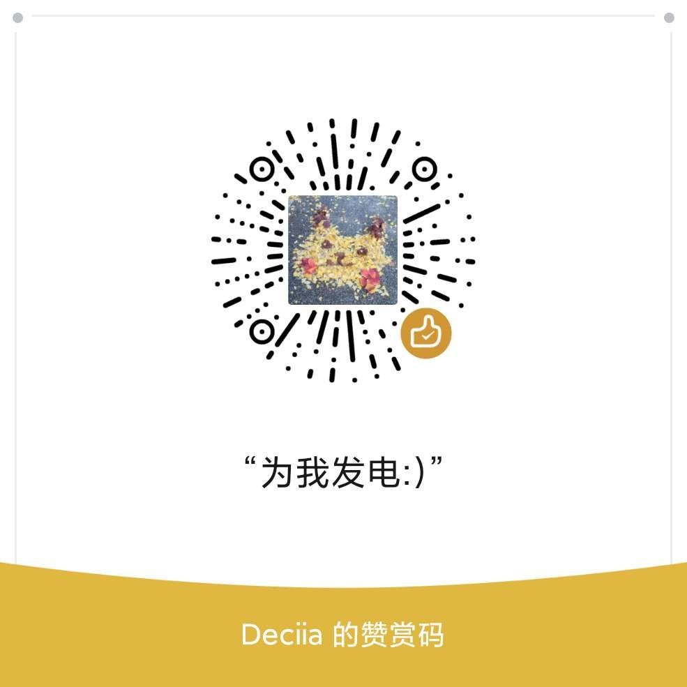

- 世界已没有真实，皆是你我的幻想。
- 目录
	- {{embed [[Contents]]}}
	- ((62f79170-e765-4e5a-bb36-83b192746ce0))
	- ((630e0cfa-6c7e-4f6b-8cc3-3900323716ae))
	- ((630e8c5c-081b-4d73-a3ed-402355460bdf))
- # 什么是庭燎馆
  id:: 62f79170-e765-4e5a-bb36-83b192746ce0
	- 庭燎一词取自 《[[小雅·庭燎]]》，它指的是庭中火炬熊熊闪光，即宫廷中的火矩。
	- 而在 @异恒deciia 设定的科幻世界中，庭燎是指平行世界中汉省的“庭燎书院”。
	- 这里是他的知识仓库，展示了作品的中间环节和原始的参考资料，所有发布的内容也会在这里存档，原始链接也会在这里找到。
	- 进入 [[庭燎馆]]了解更多。
	- 访问地址：[庭燎馆](https://tingliao.easternote.com/) 主页 tingliao.easternote.com
		- 本站 [Github 源文件](https://github.com/deciia/mylogseq/actions)
	- 个人主页 [东土记事](https://easternote.com/) easternote.com
- # 关于异恒（Deciia）
  id:: 630e0cfa-6c7e-4f6b-8cc3-3900323716ae
	- 异恒是一位好奇的幻想世界冒险者、对危机敏感的胆小鬼、让世界变得更美好的理想主义者、知识高塔的攀爬者和分享者、发现问题解决问题的空想家（如果解决不了便尝试在幻想世界中解决），幻想世界门扉钥匙的管理员。
	- 异恒参加了 [[共进创作宣言]]，打开 [[异恒deciia共进创作声明]] 了解更多
	- 创作方向
	  collapsed:: true
		- **认识世界，解释世界，推演世界，改造世界。**
		- 阅读历史认识，摘录整理分享。
		- 深入人群，认识客观现实，预测未来，寻找改造世界的方案。
		- 虚构世界，在故事中预演方案，跟进时代，改变故事的形式以利于传播和理解。
		- 参加项目，创造大众接受的文化、产品、技术，真实的改变这个世界。
	- 我希望今后的人生成为一名创作家
	  collapsed:: true
		- ## 什么是创作家
			- 以个人创作、参与创作或支持创作的方式，生产出人们喜欢的不同形式的作品
		- ## 成为创作家的条件
			- 不拘泥作品的形式
				- 文字，画，音乐，游戏、混合式的试验性作品都可以尝试
			- 全面掌握不同形式作品的创作技能
				- 优先掌握一种为主，与其它人合作中学习第二种
				- 先掌握写作，然后画画，接着视频剪辑
			- 打造自己的个人品牌，以便参与到各种创作过程中
				- 创建自媒体矩阵
				- 打造能稳定产出作品的工作流
			- 善于思考和表达
	- 异恒的自媒体
		- {{embed ((630d7e24-87aa-4b0b-af55-aeca8b4c791a))}}
	- 从一个“问题”开始的创作工作流
	  collapsed:: true
		- ## 求知、求是、求真探索
			- ### 记录笔记，发现问题
				- 生活体验
					- 记录学习、工作、生活、娱乐、社交
						- 记录已知，探索未知
						- 做好每日笔记，过好每一天
				- 阅读和虚拟体验
					- 文章阅读书籍阅读虚拟体验 -> 记录笔记 -> 回顾笔记、知识库 -> 发现问题
					- 参考[[如何才能有效的获取信息]]
				- 潜意识探索
					- 早睡早起清醒梦
					- 半小时发呆时间
			- ### 针对指定问题查证
				- 查阅资料
					- 搜索文章 -> 采集资料 -> 分类汇总 -> 提出设想
				- 委托、咨询专家
				- 实地调查
			- ### 整理笔记
				- 将资料整理成卡片
				- 建立专业领域知识库
					- 整理工具记录 -> 汇总 -> 输出知识分享 -> 发布知识分享 -> 获取反馈继续查证
				- **输出** - 知识分享
		- ## 非虚构和虚构解决方案
			- ### 方案设计，改变认知
				- 真实世界方案设计
					- 提供相对可行的解决方案，与目标受众成为朋友，为产品设计打基础
				- **输出** - 非虚构写作
			- ### 产品设计，改变世界
				- 收集需求 -> 建立对问题的认知 -> 设计产品原型 -> 测试改进 -> 收集改进需求
				- **输出** - 产品发布
			- ### 虚构世界方案设计
				- 暴露问题，如果当前真实世界解决不了，跨跃时空，提供虚构的解决方案
				- 文章，小说，漫画，音频节目，长短视频，游戏
				- **输出** - 虚构写作
			- ### 与用户互动
				- 获取相关读者获取反馈，改进解决方案
				  完成续集或二创，给故事收尾等一段时间再解封
		- ## 整备训练
			- ### 技能学习和练习
				- 文字 -> 画面 -> 音频 -> 视频 -> 电子游戏
				- 文字 -> 互动文本 -> 对话小说 -> 动态漫画 -> 动画 -> 互动音视频 -> 游戏
					- 1. ==熟悉写作，初学画画==
					  2. ==精通写作，初学互动文本，熟悉画画，初学视频剪辑==
					  3. 写作大师，熟悉互动文本，精通画画，熟悉视频剪辑，初学音乐创作
					  4. 初学文字冒险游戏，绘画大师，初学动态漫画，精通视频剪辑，熟悉音乐创作，初学动画
					  5. 熟悉文字冒险游戏，初学互动电影，熟悉动态漫画，视频剪辑大师，精通音乐创作，熟悉动画
					  6. 文字冒险游戏制作大师，熟悉互动电影，音乐创作大师，精通动画
					  7. 精通互动电影，动画大师
					  8. 互动电影制作大师
			- ### 工具准备
				- 根据技术学习进度准备工具
					- 1. 准备写作用搜集资料、记录灵感、沉浸写作的工具
					  2. 准备绘画工具，给作品画插图和设定图
					  3. 准备互动文本创作工具，先直接在Notion中用无限层笔记实现
					  4. 用RPGMAKER做成文字冒险游戏
					  5. 尝试做成互动视频
			- ### 自媒体矩阵完善
				- **输出** - 经验分享
					- 1. 非虚构创作如知识分享、经验分享、解决方案发布、产品发布、动态发布，在知乎、头条、微博
					  2. 虚构创作在公众号和B站，音频在喜马拉雅，游戏在taptap，创作笔记和动态在爱发电和B站
					  3. 全部输出都在个人站东土记事首发
- 留言和捐赠
  id:: 630e8c5c-081b-4d73-a3ed-402355460bdf
	- 捐赠只是一种支持的形式，评论、邮件或任何反馈我都欢迎在底部评论栏留言。
	  感谢通过各种渠道捐赠过我的朋友。
	- Wechat Pay 微信支付
		- {:height 252, :width 252}
	- 或者，进入 [爱发电](https://afdian.net/@deciia) 订阅我的创作。
	- 或者，支付宝？
	  collapsed:: true
		- {:height 408, :width 258}
	- 查看[[捐赠帐单]]
- ---
- 庭燎馆 （[easternote.com](https://easternote.com/) | [tingliao](https://tingliao.easternote.com/) | [wiki](http://easternote.wikidot.com/) | [fadian](https://afdian.net/@deciia) ），东土世界的图书馆。